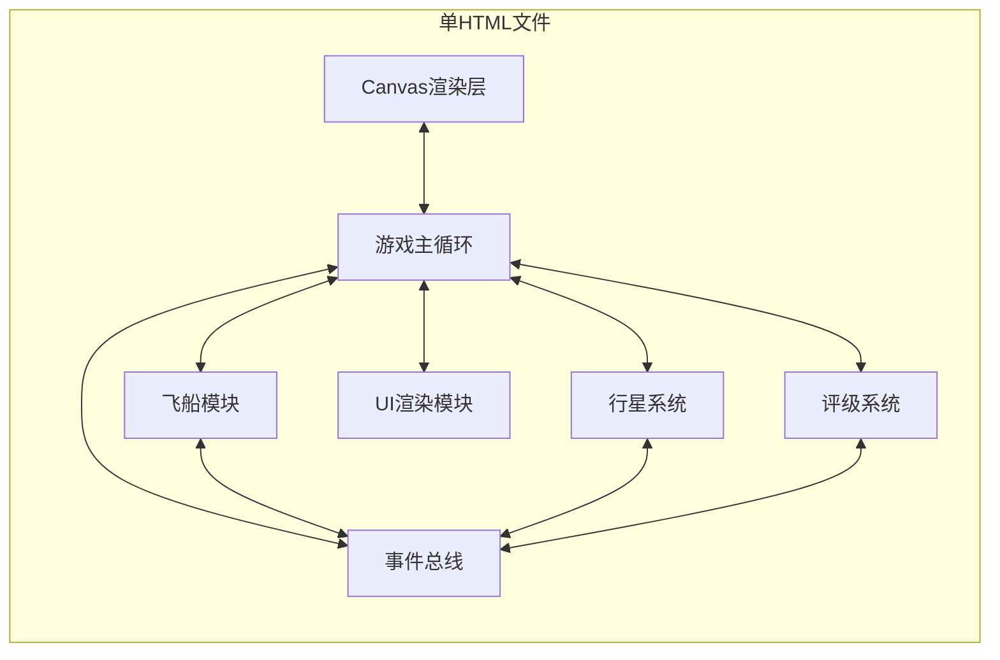

## 1. 架构设计


## 2. 技术描述
- 前端：纯HTML5 + Canvas 2D API + 原生JavaScript (ES6+)
- 架构：单文件内聚、模块化组织、IIFE隔离作用域
- 无外部依赖：所有代码内联，浏览器直接打开运行
- 代码组织：多个内联模块通过事件总线解耦通信

## 3. 内联模块定义
| 模块名称 | 职责 | 核心API |
|-------|------|---------|
| EventBus | 模块间解耦通信 | on(), off(), emit(), once() |
| StarField | 分层星点背景渲染 | render(camera), update() |
| Spaceship | 飞船物理与状态 | update(dt), applyThrust(direction), consumeFuel(amount) |
| PlanetSystem | 行星生成与管理 | generatePlanets(), getPlanetById(), checkProximity(pos, range) |
| Scanner | 扫描机制 | canScan(planet), performScan(planet), renderScanEffect() |
| ResourceManager | 资源收集与管理 | addResource(type, amount), getTotalValue() |
| UIRenderer | Canvas UI绘制 | renderStatusBars(), renderResourceList(), renderGameOver() |
| EventSystem | 随机事件管理 | scheduleNextEvent(), triggerEvent(), getEventCount() |
| RatingSystem | 评分计算 | calculateRating(stats), setWeights(weights) |
| GameLoop | 主循环控制 | start(), stop(), reset() |

## 4. 数据模型定义

### 4.1 核心接口（JSDoc）
```javascript
/**
 * @typedef {Object} IPlanet
 * @property {string} id - 行星唯一标识
 * @property {number} x - 世界坐标X
 * @property {number} y - 世界坐标Y
 * @property {number} radius - 半径 (20~60px)
 * @property {string} color - 颜色
 * @property {'iron'|'water'|'rareGas'} resourceType - 资源类型
 * @property {number} resourceAmount - 资源数量
 * @property {boolean} isScanned - 是否已扫描
 * @property {boolean} isSupplyStation - 是否为补给站
 * @method scan - 执行扫描返回资源
 * @method render - Canvas渲染方法
 */

/**
 * @typedef {Object} GameState
 * @property {number} fuel - 当前燃料 (0-100)
 * @property {number} scanEnergy - 当前扫描能量 (0-100)
 * @property {Object} position - 飞船世界坐标 {x, y}
 * @property {Object} velocity - 速度矢量 {x, y}
 * @property {number} heading - 朝向角度
 * @property {Object} resources - 已收集资源
 * @property {number} scannedPlanets - 已勘探行星数
 * @property {number} eventCount - 遭遇事件次数
 * @property {number} startTime - 游戏开始时间戳
 * @property {boolean} isGameOver - 游戏结束状态
 */
```

### 4.2 行星类层次
- RockyPlanet：岩石行星，只能扫描一次，扫描后变灰色
- GasGiant：气态巨行星，可重复扫描但收益递减
- SupplyStation：补给站行星（继承RockyPlanet），带蓝紫色光环

## 5. 关键参数常量
| 参数名称 | 值 | 说明 |
|---------|-----|------|
| MAX_FUEL | 100 | 最大燃料 |
| INITIAL_FUEL | 100 | 初始燃料 |
| MAX_SCAN_ENERGY | 100 | 最大扫描能量 |
| SCAN_COST | 15 | 每次扫描消耗 |
| SCAN_RANGE | 60 | 扫描有效距离px |
| SUPPLY_RANGE | 50 | 补给站停靠范围px |
| FUEL_CONSUMPTION_RATE | 8 | 全速每秒消耗 |
| ENERGY_RECOVERY_RATE | 2 | 每秒能量恢复 |
| MAX_THRUST | 200 | 最大加速度px/s² |
| MIN_PLANET_SPACING | 150 | 行星最小间距px |
| PLANET_COUNT | 8 | 最少行星数 |
| SUPPLY_STATION_COUNT | 2 | 补给站数量 |
| STAR_COUNT | 200 | 背景星点数 |
| STAR_LAYERS | 3 | 视差层数 |
| EVENT_BASE_INTERVAL | 20000 | 事件基准间隔ms |
| EVENT_DEVIATION | 5000 | 事件偏差ms |
| SCAN_EFFECT_DURATION | 500 | 扫描动画ms |

## 6. 随机事件池定义
| 事件名称 | 效果 |
|---------|------|
| 引力异常 | 瞬间改变飞船速度矢量（随机方向×50px/s） |
| 陨石群 | 生成3个微小障碍物飞过屏幕，碰撞扣10点能量 |
| 远古信号 | 在屏幕上提示附近存在未扫描行星（箭头指示方向） |
