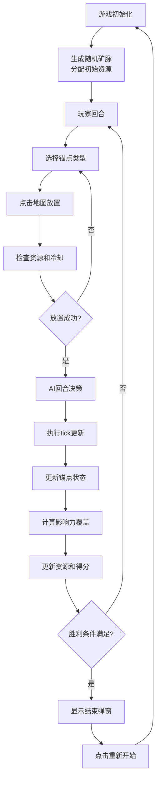

## 1. 产品概述

《量子裂隙：锚点争夺》是一款科幻未来题材的2D策略对抗游戏，玩家通过在20×20网格地图上放置三种不同类型的锚点，与AI进行资源争夺和影响力扩张。游戏采用回合制tick机制，通过Canvas渲染实现流畅的视觉效果和量子叠加态动画。

- **核心目标**：通过策略性放置锚点，扩大己方影响力覆盖范围，在100 tick内达到70%覆盖率或结束时拥有更高覆盖率获胜
- **目标用户**：策略游戏爱好者、休闲玩家，支持PC端和移动端游玩
- **产品价值**：提供深度策略玩法与科幻视觉体验的结合，单文件即可运行，无需安装

## 2. 核心功能

### 2.1 用户角色
| 角色 | 操作方式 | 核心权限 |
|------|----------|----------|
| 玩家 | 鼠标/触屏点击 | 选择锚点类型、放置锚点、查看游戏状态 |
| AI | 自动决策 | 分析局势、选择最优锚点类型和位置 |

### 2.2 功能模块
1. **游戏主界面**：Canvas游戏画布、UI控制面板、状态显示区域
2. **锚点系统**：三种锚点类型（能量、物质、信息），实现统一接口
3. **回合制系统**：1000ms/tick的逻辑更新，包含状态更新、资源计算、胜利检测
4. **AI决策系统**：基于局势分析的智能放置策略
5. **渲染系统**：requestAnimationFrame驱动的60fps渲染，包含影响力扩散动画和量子叠加效果

### 2.3 页面详情
| 页面名称 | 模块名称 | 功能描述 |
|----------|----------|----------|
| 游戏主界面 | Canvas画布 | 20×20网格地图渲染、锚点绘制、影响力扩散动画、量子叠加态混合效果 |
| 游戏主界面 | 控制面板 | 三种锚点选择按钮（显示冷却时间）、资源显示、tick计数、影响力百分比 |
| 游戏主界面 | 结束弹窗 | 显示胜负结果、重新开始按钮 |

## 3. 核心流程

## 4. 用户界面设计

### 4.1 设计风格
- **主色调**：深空黑背景（#0a0a1a），配合霓虹蓝、霓虹红、霓虹绿三种阵营色
- **科幻风格**：发光边框、粒子效果、渐变透明度、网格扫描线
- **字体**：使用Orbitron（科幻字体）作为标题，Roboto作为正文
- **按钮风格**：圆角矩形，发光边框，悬停时有脉冲动画，最小尺寸44×44px
- **布局**：左侧Canvas游戏区（自适应缩放），右侧垂直UI面板（固定宽度）
- **视觉效果**：量子叠加态采用颜色混合+透明度叠加+噪声纹理

### 4.2 页面设计概述
| 页面名称 | 模块名称 | UI元素 |
|----------|----------|--------|
| 游戏主界面 | Canvas画布 | 20×20网格、彩色锚点、渐变影响力区域、量子叠加混合效果、平滑动画过渡 |
| 游戏主界面 | 控制面板 | 发光按钮、冷却时间数字、资源条形图、进度条显示tick进度、百分比环形图显示影响力 |
| 游戏主界面 | 结束弹窗 | 半透明黑色背景、大标题胜负结果、统计数据展示、发光重新开始按钮 |

### 4.3 响应式设计
- **桌面优先**：Canvas区域占70%宽度，UI面板占30%宽度
- **移动端适配**：垂直布局，Canvas在上（全屏宽度），UI面板在下（横向排列按钮）
- **触摸优化**：所有按钮最小44×44px，点击反馈放大动画
- **窗口 resize**：500ms防抖后重新计算Canvas尺寸和坐标映射

### 4.4 动画效果指导
- **影响力扩散**：径向渐变动画，使用ease-out缓动函数
- **量子叠加态**：HSB颜色插值，配合透明度脉动效果
- **锚点放置**：缩放+淡入动画，粒子爆炸效果
- **按钮交互**：悬停时发光增强，点击时缩放反馈
- **tick过渡**：网格线短暂高亮闪烁
