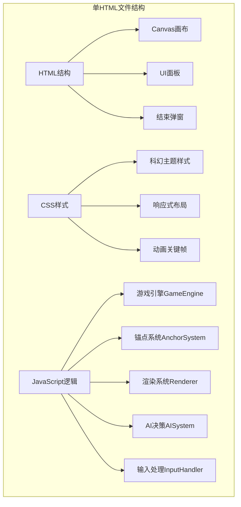

## 1. 架构设计



## 2. 技术描述

- **技术栈**：原生HTML5 + CSS3 + JavaScript (ES6+)
- **渲染引擎**：Canvas 2D API，requestAnimationFrame驱动
- **架构模式**：模块化类结构，面向对象设计
- **无外部依赖**：单文件自包含，CDN引入Google Fonts
- **性能目标**：渲染帧率≥30fps，AI决策≤200ms，交互响应≤200ms

## 3. 核心类定义

### 3.1 锚点接口定义

```typescript
interface IAnchor {
    place(x: number, y: number): void;
    update(worldState: WorldState): void;
    getInfluenceRange(): number;
    getType(): { faction: string; type: string };
    getPosition(): { x: number; y: number };
}
```

### 3.2 锚点实现类

| 类名 | 阵营色 | 核心能力 | 冷却 |
|------|--------|----------|------|
| EnergyAnchor | 蓝色 #00d4ff | 增加周围2格矿脉产出速度 | 2 tick |
| MatterAnchor | 红色 #ff4466 | 削弱范围内敌方锚点影响力 | 3 tick |
| InfoAnchor | 绿色 #44ff88 | 视野+窃取3格内敌方资源 | 4 tick |

### 3.3 核心引擎类

1. **GameEngine**：游戏主循环、tick管理、状态同步
2. **GridMap**：20×20网格数据、影响力计算、矿脉管理
3. **AnchorManager**：锚点创建、更新、干涉检测
4. **Renderer**：Canvas绘制、动画插值、视觉效果
5. **AIController**：局势评估、策略选择、位置决策
6. **ResourceSystem**：资源计算、冷却管理、产出统计

## 4. 数据结构

### 4.1 游戏状态WorldState

```javascript
{
    tick: number,           // 当前tick数
    maxTick: 100,           // 最大tick数
    gridSize: 20,           // 网格尺寸
    resources: {
        player: number,     // 玩家资源
        ai: number          // AI资源
    },
    influence: {
        player: number,     // 玩家影响力百分比
        ai: number          // AI影响力百分比
    },
    cooldowns: {            // 玩家冷却时间
        energy: number,
        matter: number,
        info: number
    },
    aiCooldowns: {          // AI冷却时间
        energy: number,
        matter: number,
        info: number
    },
    grid: GridCell[][],     // 网格数据
    anchors: IAnchor[],     // 所有锚点
    mineralVeins: {x, y}[]  // 量子矿脉位置
}
```

### 4.2 网格单元格GridCell

```javascript
{
    x: number,
    y: number,
    influence: {
        player: number,     // 玩家影响力值 0-1
        ai: number          // AI影响力值 0-1
    },
    owner: null | 'player' | 'ai',  // 归属方
    hasMineral: boolean     // 是否有矿脉
}
```

## 5. 关键算法

### 5.1 影响力扩散算法
- 每个锚点基础半径：能量=3，物质=2.5，信息=3.5
- 同阵营共振：距离≤3格时，扩散速度+20%
- 异阵营湮灭：距离≤2格时，半径不扩张并回缩5%
- 叠加态计算：双线性插值颜色混合，HSB空间插值

### 5.2 AI决策算法（≤200ms）
1. 局势评估：计算双方主导区域、前线位置
2. 策略权重：
   - 劣势时优先物质锚点（防御）
   - 均势时优先能量锚点（发展）
   - 优势时优先信息锚点（掠夺）
3. 位置评分：结合距离前线、靠近矿脉、避开敌方密集区
4. 贪心选择：取Top3位置随机选择，避免完全确定性

### 5.3 动画系统
- 使用requestAnimationFrame实现60fps渲染
- 影响力扩散使用时间插值（lerp）
- tick间状态平滑过渡（alpha = elapsed / tickInterval）
- 量子叠加态使用正弦函数调制透明度产生脉动效果

## 6. 性能优化

1. **渲染优化**：
   - 离屏Canvas预渲染网格背景
   - 影响力区域使用渐变而非逐格绘制
   - 脏矩形区域重绘机制

2. **计算优化**：
   - 锚点干涉使用空间哈希网格
   - 影响力计算使用广度优先搜索
   - AI决策使用启发式剪枝

3. **响应式优化**：
   - resize事件500ms防抖
   - 坐标映射使用预计算变换矩阵
   - 触摸事件使用passive: true提升滚动性能
