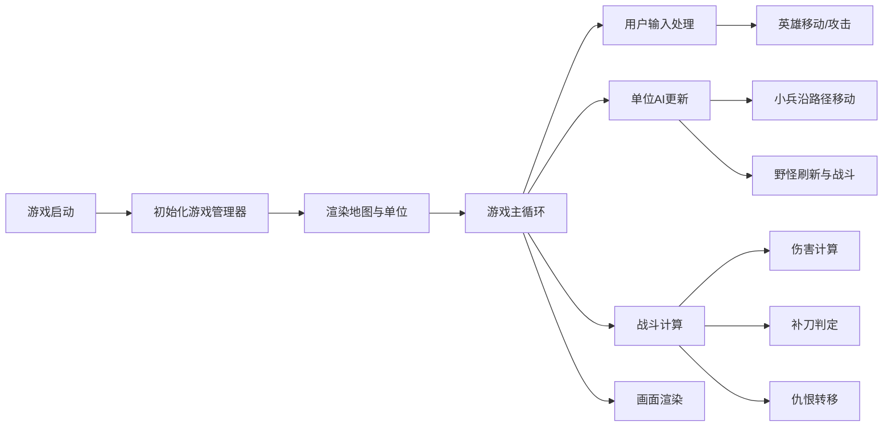

## 1. 产品概述

MOBA兵线、野区与防御塔战斗模拟器，直观展示小兵推进、补刀、仇恨转移等核心机制。
- 主要目的：通过可视化模拟帮助理解MOBA游戏的核心战斗机制
- 目标用户：游戏开发者、MOBA游戏爱好者、游戏机制学习者

## 2. 核心功能

### 2.1 用户角色
| 角色 | 注册方式 | 核心权限 |
|------|----------|----------|
| 玩家 | 无需注册 | 操控英雄、观察战斗、测试机制 |

### 2.2 功能模块
1. **游戏主页面**：Canvas地图渲染、单位动画、UI面板
2. **兵线系统**：小兵生成、移动、攻击、死亡
3. **野怪系统**：Buff野怪刷新、战斗、Buff效果
4. **英雄系统**：移动、攻击、补刀、Buff
5. **防御塔系统**：攻击、仇恨、摧毁

### 2.3 页面详情
| 页面名称 | 模块名称 | 功能描述 |
|---------|---------|----------|
| 游戏主页面 | Canvas渲染 | 1200x800地图，三路兵线、河道、野区 |
| 游戏主页面 | UI面板 | 金币、补刀数、生命值、Buff图标 |
| 游戏主页面 | 用户操控 | 鼠标点击选择、右键移动、A键攻击 |

## 3. 核心流程

游戏启动 → 初始化地图和单位 → 游戏循环渲染 → 用户操控英雄 → 观察兵线自动推进 → 野怪定时刷新 → 战斗自动进行

## 4. 用户界面设计

### 4.1 设计风格
- 主色调：深蓝背景，蓝绿色（河道、、
- 单位颜色：近战兵红色、远程兵蓝色、攻城车紫色、英雄金色、野怪橙色、防御塔灰色
- 字体：使用系统无衬线字体，清晰易读
- 布局：Canvas居中，UI面板位于左上角和右侧
- 图标风格：简洁几何图形

### 4.2 页面设计概览
| 页面名称 | 模块名称 | UI元素 |
|---------|---------|--------|
| 游戏主页面 | Canvas地图 | 兵线路径、野区营地、防御塔位置 |
| 游戏主页面 | 左上角UI | 金币数值、补刀计数、生命值条 |
| 游戏主页面 | 右侧Buff面板 | Buff图标、倒计时数字 |

### 4.3 响应式
- 桌面优先，固定尺寸Canvas
- 无移动端适配需求

### 4.4 动画效果
- 单位移动平滑动画
- 攻击效果闪光效果
- 死亡淡出效果
- Buff图标旋转动画
