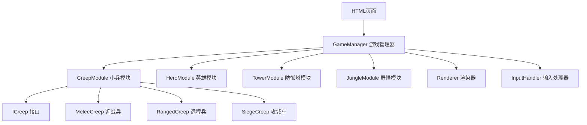

## 1. 架构设计



## 2. 技术说明

- 前端：纯原生 JavaScript ES6 + HTML5 Canvas
- 无外部依赖，单文件HTML，可直接在浏览器打开
- 模块化设计，使用对象字面量和类实现

## 3. 核心模块定义

### 3.1 模块列表
| 模块 | 职责 |
|------|------|
| GameManager | 游戏主循环、时间管理、波次控制、全局状态 |
| CreepModule | 小兵生成、移动、攻击、死亡逻辑 |
| HeroModule | 英雄操控、补刀判定、Buff管理 |
| TowerModule | 防御塔攻击、仇恨逻辑、摧毁判定 |
| JungleModule | 野怪刷新、战斗、Buff发放 |
| Renderer | Canvas绘制、UI渲染、动画效果 |
| InputHandler | 鼠标键盘事件处理 |

### 3.2 ICreep 接口定义
```javascript
/**
 * 小兵行为接口 ICreep
 * 所有小兵类型必须实现以下方法
 */
interface ICreep {
    move(targetX, targetY): void;      // 移动到目标位置
    attack(target): void;              // 攻击目标
    takeDamage(damage, attacker): void;// 受到伤害
    die(): void;                       // 死亡处理
    getThreatLevel(): number;          // 获取威胁值
}
```

## 4. 数据模型

### 4.1 单位属性
| 单位类型 | 生命值 | 攻击力 | 攻速 | 移速 | 射程 |
|---------|--------|--------|------|------|------|
| 近战兵 | 500 | 25 | 0.8 | 100 | 50 |
| 远程兵 | 300 | 35 | 0.8 | 100 | 150 |
| 攻城车 | 800 | 50 | 0.6 | 80 | 100 |
| 英雄 | 1000 | 50 | 0.8 | 200 | 125 |
| 防御塔 | 2000 | 200 | 1.0 | 0 | 300 |
| 红Buff怪 | 1500 | 80 | 0.8 | 0 | 100 |
| 蓝Buff怪 | 1500 | 80 | 0.8 | 0 | 100 |

### 4.2 游戏常量
- 地图尺寸：1200 x 800 像素
- 小兵波次间隔：60秒
- 首次出兵：游戏开始后30秒
- 攻城车出现时间：10分钟后
- 野怪首次刷新：30秒
- 野怪重生时间：60秒
- Buff持续时间：120秒
- 补刀生命值阈值：10% 最大生命值
