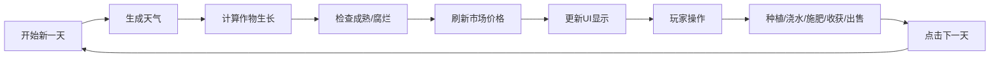

## 1. 产品概述
农场模拟游戏是一款轻量级的单页HTML经营类游戏，玩家通过种植、管理、收获作物来积累财富，体验农场经营的乐趣。
- 核心玩法：土地管理、作物种植、天气影响、市场交易、季节变化
- 目标用户：休闲游戏爱好者、模拟经营类游戏玩家

## 2. 核心功能

### 2.1 功能模块
1. **农场管理模块**：6块土地管理、种植/浇水/施肥/收获/清理操作
2. **作物模块**：5种不同作物、3阶段生长、属性配置
3. **天气模块**：每日天气生成、生长效率影响、季节关联
4. **市场模块**：价格波动、作物出售、肥料购买
5. **库存模块**：作物库存管理、金币统计

### 2.2 页面详情
| 页面名称 | 模块名称 | 功能描述 |
|---------|---------|---------|
| 主游戏页面 | 顶部信息栏 | 显示天数、季节、天气、金币 |
| 主游戏页面 | 土地网格区 | 6块土地展示、作物状态、操作按钮 |
| 主游戏页面 | 右侧库存栏 | 作物库存列表、出售按钮 |
| 主游戏页面 | 底部操作栏 | 下一天按钮、购买肥料按钮 |

## 3. 核心流程
玩家点击"下一天"按钮触发回合流程：天气更新→作物生长计算→成熟/腐烂检查→市场价格刷新→库存统计

## 4. 用户界面设计
### 4.1 设计风格
- 主色调：农场绿色系（#4CAF50、#8BC34A）搭配土地棕色（#795548）
- 按钮风格：圆角矩形，悬停有微动画效果
- 字体：使用Google Fonts的'ZCOOL KuaiLe'（中文）或'Fredoka'（数字）营造卡通农场氛围
- 布局：卡片式布局，土地使用网格展示
- 图标：使用emoji图标（🌱🌾☀️🌧️💰）增强农场氛围

### 4.2 页面设计概述
| 页面名称 | 模块名称 | UI元素 |
|---------|---------|---------|
| 主游戏页面 | 顶部信息栏 | 天数徽章、季节图标、天气emoji、金币显示 |
| 主游戏页面 | 土地网格区 | 2×3网格、土地卡片、进度条、状态标签、操作按钮 |
| 主游戏页面 | 右侧库存栏 | 库存列表、数量显示、出售按钮 |
| 主游戏页面 | 底部操作栏 | 主要操作按钮、提示信息 |

### 4.3 响应性
桌面端优先设计，使用Flex和Grid布局自适应，按钮尺寸适合鼠标点击
