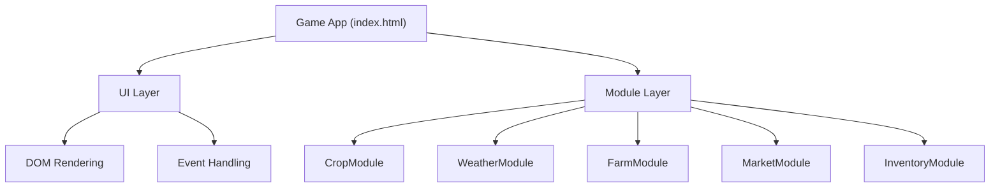

## 1. 架构设计
单文件HTML应用，采用模块化JavaScript设计，所有代码内联。



## 2. 技术描述
- 前端：原生HTML5 + CSS3 + JavaScript (ES6+)
- 无外部依赖，所有代码内联在单个HTML文件中
- 模块化设计：IIFE模式实现模块封装
- CSS：使用CSS变量、Flexbox、Grid布局

## 3. 模块接口定义

### 3.1 作物模块 (CropModule)
```javascript
interface CropModule {
  getCropList(): Crop[];
  getCrop(id: string): Crop | undefined;
  getGrowthStage(cropId: string, progress: number): string;
  getStageThreshold(cropId: string): number[];
}

interface Crop {
  id: string;
  name: string;
  growDays: number;
  baseWater: number;
  lightCoeff: number;
  basePrice: number;
  emoji: string;
}
```

### 3.2 天气模块 (WeatherModule)
```javascript
interface WeatherModule {
  generateWeather(season: string): Weather;
  getGrowthEfficiency(weather: string): number;
  getAutoWater(weather: string): number;
}

type WeatherType = 'sunny' | 'cloudy' | 'rainy';
interface Weather {
  type: WeatherType;
  emoji: string;
  name: string;
}
```

### 3.3 农场模块 (FarmModule)
```javascript
interface FarmModule {
  initPlots(count: number): Plot[];
  plant(plots: Plot[], index: number, cropId: string): boolean;
  water(plots: Plot[], index: number): boolean;
  fertilize(plots: Plot[], index: number): boolean;
  harvest(plots: Plot[], index: number): string | null;
  clearRotten(plots: Plot[], index: number): boolean;
  updateGrowth(plots: Plot[], weather: Weather, day: number): Plot[];
  checkRotten(plots: Plot[], season: string, weather: string): Plot[];
}

interface Plot {
  id: number;
  state: 'idle' | 'planted' | 'mature' | 'rotten';
  cropId: string | null;
  plantDay: number | null;
  progress: number;
  watered: boolean;
  fertilizedDays: number;
  polluted: boolean;
}
```

### 3.4 市场模块 (MarketModule)
```javascript
interface MarketModule {
  refreshPrices(crops: Crop[]): MarketPrices;
  getSellPrice(prices: MarketPrices, cropId: string): number;
  FERTILIZER_PRICE: number;
}

interface MarketPrices {
  [cropId: string]: {
    buy: number;
    sell: number;
  };
}
```

### 3.5 库存模块 (InventoryModule)
```javascript
interface InventoryModule {
  init(): Inventory;
  addCrop(inventory: Inventory, cropId: string): Inventory;
  removeCrop(inventory: Inventory, cropId: string): boolean;
  addGold(inventory: Inventory, amount: number): Inventory;
  spendGold(inventory: Inventory, amount: number): boolean;
  getCropCount(inventory: Inventory, cropId: string): number;
}

interface Inventory {
  gold: number;
  crops: { [cropId: string]: number };
  fertilizer: number;
}
```

## 4. 游戏状态模型

```javascript
interface GameState {
  day: number;
  season: string;
  weather: Weather;
  plots: Plot[];
  inventory: Inventory;
  marketPrices: MarketPrices;
}
```

## 5. 常量配置

### 5.1 作物配置
- 胡萝卜：3天，需水量2，喜光0.8，基础价15
- 玉米：5天，需水量3，喜光1.0，基础价25
- 番茄：4天，需水量4，喜光0.9，基础价35
- 南瓜：6天，需水量3，喜光0.7，基础价50
- 草莓：5天，需水量5，喜光0.85，基础价45

### 5.2 季节配置
- 春季：每7天切换，雨天概率30%
- 夏季：晴天概率60%，生长效率+10%
- 秋季：多云概率50%
- 冬季：生长效率-20%，腐烂概率+30%

### 5.3 腐烂概率
- 基础概率：15%
- 雨天修正：+10%
- 冬季修正：+15%
