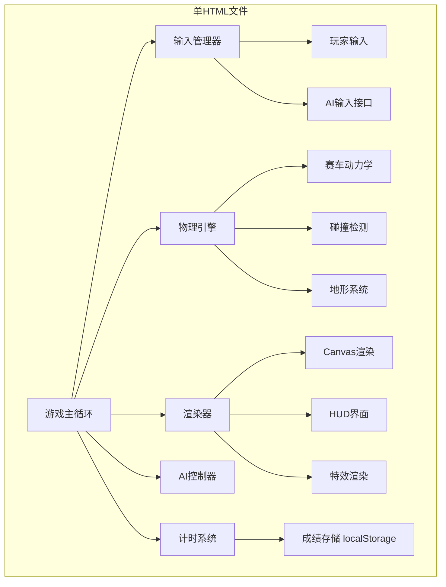

# 俯视视角赛车竞速游戏 - 技术架构文档

## 1. 架构设计



## 2. 技术描述

- **前端技术**: 原生 HTML5 + JavaScript (ES6+) + Canvas API
- **输出格式**: 单个自包含HTML文件，无外部依赖
- **模块化方式**: 使用IIFE和类命名空间模拟模块化
- **游戏循环**: requestAnimationFrame，支持60FPS
- **数据存储**: localStorage存储历史最佳成绩

## 3. 模块设计

### 3.1 核心模块结构

| 模块 | 类/接口名 | 职责 |
|------|-----------|------|
| 输入系统 | IInputProvider | 输入提供者接口 |
| | PlayerInput | 玩家键盘输入处理 |
| | AIInput | AI输入实现 |
| 物理引擎 | PhysicsEngine | 赛车动力学、碰撞检测 |
| | CarPhysics | 单辆赛车物理状态 |
| 赛道系统 | Track | 赛道数据生成、地形检测 |
| AI系统 | AIController | AI路径跟随、避障 |
| 渲染器 | Renderer | Canvas渲染主逻辑 |
| | HUDRenderer | HUD界面渲染 |
| 游戏主类 | RacingGame | 游戏主循环、状态管理 |

### 3.2 关键接口定义

```typescript
interface IInputProvider {
    getAcceleration(): number;      // -1 到 1
    getSteering(): number;          // -1 到 1
    getBrake(): number;             // 0 到 1
    getNitro(): boolean;
    getDrift(): boolean;
}

interface CarState {
    x: number;
    y: number;
    angle: number;
    speed: number;
    angularVelocity: number;
    nitro: number;
    isDrifting: boolean;
}

interface TerrainType {
    name: string;
    friction: number;      // 摩擦力系数
    speedMultiplier: number; // 速度乘数
    grip: number;          // 抓地力系数
}
```

## 4. 物理参数设计

### 4.1 赛车参数
- 最大速度: 280 km/h
- 加速度: 8 m/s²
- 刹车减速度: 15 m/s²
- 转向角速度: 3.5 rad/s
- 氮气加速倍率: 1.5x
- 氮气最大容量: 100
- 氮气恢复速率: 5/秒
- 漂移氮气积攒: 10/秒

### 4.2 地形参数
- **路面**: 摩擦1.0, 速度1.0, 抓地力1.0
- **草地**: 摩擦0.8, 速度0.7, 抓地力0.6
- **沙地**: 摩擦0.5, 速度0.5, 抓地力0.3

## 5. 赛道设计参数
- 画布尺寸: 1200x800
- 赛道宽度: 60px
- 弯道数量: ≥5个不同半径
- 直道长度: ≥画布宽度80% (960px)
- 目标单圈时间: 45-60秒
