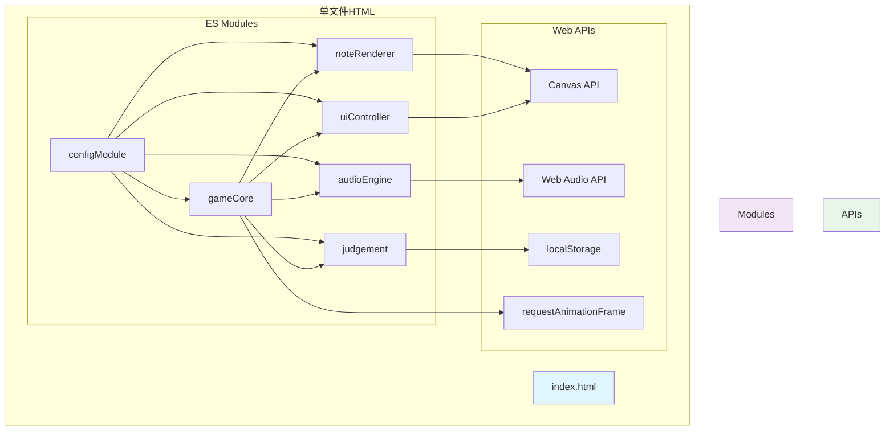

## 1. 架构设计



## 2. 技术描述

- 前端：纯HTML5 + ES6 Modules + Canvas 2D + Web Audio API
- 构建：单文件HTML，内联所有代码，零外部依赖
- 存储：localStorage保存音频校准设置
- 兼容性：Chrome/Firefox最新版，移动端兼容

## 3. 模块设计

### 3.1 核心模块列表

| 模块名称 | 职责 | 输出/事件 |
|---------|------|----------|
| configModule | 集中管理所有游戏参数 | 配置对象 |
| audioEngine | 音频加载、解码、播放、混合、合成音色 | 音频播放状态 |
| noteRenderer | Canvas渲染：轨道、音符、粒子、特效 | 渲染帧 |
| judgement | 判定逻辑、分数计算、连击系统 | judge事件 |
| uiController | UI状态管理、HUD渲染、特效调度 | ui事件 |
| gameCore | 主循环、状态机、输入处理、流程控制 | 游戏状态 |

### 3.2 模块间通信

使用自定义事件系统：
- gameCore 发出 timeupdate → noteRenderer 更新音符位置
- gameCore 发出 input → judgement 进行判定
- judgement 发出 judge → uiController 显示判定文字/粒子
- judgement 发出 combo → uiController 更新连击
- audioEngine 发出 ended → gameCore 进入结算

## 4. 核心数据结构

### 4.1 谱面数据格式
```javascript
{
  id: string,
  title: string,
  artist: string,
  bpm: number,
  duration: number,
  notes: [
    { time: number, lane: number } // time: 秒, lane: 0-3
  ]
}
```

### 4.2 游戏状态
```javascript
{
  state: 'menu' | 'playing' | 'paused' | 'result',
  score: number,
  combo: number,
  maxCombo: number,
  perfect: number,
  great: number,
  good: number,
  miss: number,
  currentTime: number,
  offset: number // 音频校准偏移
}
```

### 4.3 判定配置
```javascript
{
  perfect: 40,   // ms
  great: 90,     // ms
  good: 150,     // ms
  miss: 150      // ms
}
```

## 5. 性能优化

- 使用 requestAnimationFrame 驱动主循环
- 基于时间戳的动画计算，非帧率依赖
- 对象池复用粒子对象，避免频繁GC
- 页面不可见时自动暂停并静音
- 移动端使用 touchstart/touchend 事件优化响应
