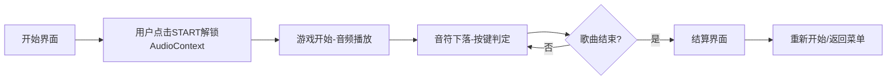

## 1. 产品概述

单文件HTML音乐节奏游戏，4轨道下落式玩法，零外部依赖，双击即可运行。
- 核心目的：提供可离线使用的音乐节奏游戏体验，支持键盘与触摸操作
- 目标用户：节奏游戏爱好者，需要无需安装即可游玩的轻量级游戏

## 2. 核心功能

### 2.1 功能模块
1. **开始界面**：歌曲选择、音频延迟校准、按键自定义
2. **游戏界面**：4轨道音符下落、实时判定反馈、分数与连击显示
3. **结算界面**：详细统计数据、评级展示

### 2.2 页面详情
| 页面名称 | 模块名称 | 功能描述 |
|---------|---------|---------|
| 开始界面 | 配置区域 | 延迟校准滑块(-200ms~+200ms)、按键自定义设置 |
| 开始界面 | 歌曲选择 | 内置歌曲选择与谱面预览 |
| 游戏界面 | 音符渲染 | Canvas渲染4轨道下落音符、判定线 |
| 游戏界面 | 判定系统 | Perfect/Great/Good/Miss四级判定 |
| 游戏界面 | 视觉反馈 | 轨道高亮、粒子特效、屏幕震动 |
| 游戏界面 | 音频反馈 | 按键触发对应音色样本 |
| 结算界面 | 统计面板 | 判定计数、最大连击、总分、评级 |

## 3. 核心流程

## 4. 用户界面设计

### 4.1 设计风格
- 主色调：深黑背景(#0a0a0f) + 霓虹蓝紫渐变(#6366f1, #8b5cf6, #ec4899)
- 辅助色：Perfect绿(#10b981)、Great黄(#f59e0b)、Good蓝(#3b82f6)、Miss红(#ef4444)
- 字体：使用等宽字体'JetBrains Mono'，数字显示用'Orbitron'
- 布局：4等宽垂直轨道，判定线位于屏幕下方1/6处
- 视觉风格：赛博朋克霓虹风格，发光边框、粒子特效

### 4.2 页面设计概览
| 页面名称 | 模块名称 | UI元素 |
|---------|---------|--------|
| 开始界面 | 配置面板 | 半透明玻璃态卡片、渐变按钮、滑块控件 |
| 游戏界面 | 游戏区域 | 霓虹发光轨道、动态音符、粒子系统 |
| 游戏界面 | HUD | 右上角分数、左上角连击数、底部进度条 |
| 结算界面 | 统计面板 | 居中玻璃态卡片、评级大字、数据表格 |

### 4.3 响应式设计
- 桌面端：全Canvas游戏区域，4等宽轨道
- 移动端：屏幕下半部分4个触摸区域，阻止默认滚动缩放
- 触摸优化：大尺寸触摸区域，按压视觉反馈
