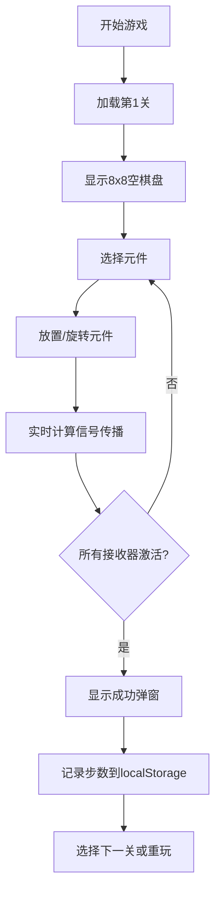

## 1. 产品概述

基于8x8网格的信号路由解谜游戏，玩家通过放置和旋转导线元件，将信号从源点传导到所有接收器。采用单文件HTML设计，可在现代浏览器中直接离线运行。

- 核心目标：提供具有渐进难度的益智解谜体验
- 目标用户：休闲游戏玩家、谜题爱好者
- 市场价值：无需安装、跨平台、可嵌入任意网页

## 2. 核心功能

### 2.1 功能模块
1. **游戏棋盘**：8x8网格布局，信号源、接收器、可放置元件
2. **元件面板**：4种元件选择（直线、拐角、T型分线器、绝缘方块）
3. **关卡系统**：5个预设关卡，支持前后切换和编号跳转
4. **操作管理**：撤销、重置、步数计数
5. **胜利判定**：所有接收器激活时显示成功提示

### 2.2 功能详情
| 功能模块 | 子模块 | 功能描述 |
|---------|--------|---------|
| 游戏棋盘 | 信号传播 | 从信号源递归扩散，支持分线器分流，环路保护 |
| 游戏棋盘 | 视觉反馈 | 激活元件亮金色高亮，接收器激活亮蓝动画 |
| 元件面板 | 元件选择 | 点击选中、拖拽放置、键盘1-4快捷切换 |
| 操作管理 | 撤销功能 | Ctrl+Z快捷键，步数同步回退 |
| 操作管理 | 重置功能 | R快捷键，恢复关卡初始状态 |
| 关卡系统 | 数据存储 | localStorage记录各关卡最佳步数 |

## 3. 核心流程

用户选择关卡 → 点击/拖拽放置元件 → 右键旋转元件 → 信号实时传播计算 → 所有接收器激活 → 显示成功弹窗记录步数

## 4. 用户界面设计

### 4.1 设计风格
- **主题色调**：深灰背景（#1a1a2e），元件深灰，激活亮金（#ffd700），信号源红色（#ff4444），接收器蓝色（#4488ff）
- **按钮风格**：圆角矩形，悬浮微亮，点击凹陷效果
- **字体**：现代无衬线字体，标题加粗，正文清晰易读
- **布局风格**：左侧元件面板，中央棋盘，顶部信息栏，底部控制栏
- **动画**：接收器激活脉冲，信号传播闪烁，胜利弹窗淡入

### 4.2 页面设计
| 区域 | 模块 | UI元素 |
|------|------|--------|
| 顶部 | 信息栏 | 关卡编号、步数计数、最佳步数显示 |
| 左侧 | 元件面板 | 4种元件图标，选中状态高亮 |
| 中央 | 游戏棋盘 | 8x8网格，信号源红点，接收器蓝框 |
| 底部 | 控制栏 | 上一关、下一关、撤销、重置、关卡跳转 |
| 弹窗 | 胜利提示 | 通关用时、步数、继续按钮 |

### 4.3 响应式
- 桌面端：固定宽度布局，元件垂直排列
- 平板端：棋盘等比缩放，元件水平排列
- 移动端（320px起）：全宽棋盘，触摸友好按钮，双击旋转
