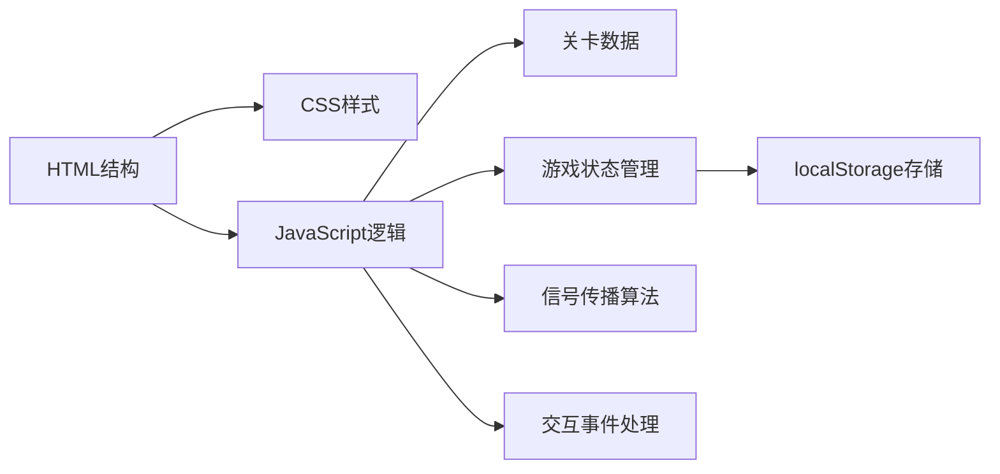

## 1. 架构设计

单文件HTML架构，所有代码包含在一个文件中，无外部依赖。



## 2. 技术描述

- **前端技术**：纯HTML5 + CSS3 + Vanilla JavaScript (ES6+)
- **渲染方式**：DOM + Canvas混合渲染（网格用DOM，元件绘制用Canvas或SVG）
- **无外部依赖**：所有代码内联在单个HTML文件中
- **浏览器兼容**：Chrome、Firefox、Edge等现代浏览器

## 3. 数据结构

### 3.1 关卡数据结构
```javascript
const LEVELS = [
  {
    id: 1,
    name: "初学者之路",
    source: { x: 0, y: 3 },
    receivers: [{ x: 7, y: 3 }, { x: 7, y: 5 }],
    obstacles: []
  }
];
```

### 3.2 元件类型
| 类型 | 编码 | 连接方向 | 可旋转 |
|------|------|----------|--------|
| 直线 | 1 | 上下或左右 | 是 |
| 拐角 | 2 | 两相邻方向 | 是 |
| T型分线器 | 3 | 三个方向 | 是 |
| 绝缘方块 | 4 | 无 | 否 |

### 3.3 游戏状态
```javascript
const gameState = {
  currentLevel: 1,
  steps: 0,
  history: [],
  grid: [],
  selectedComponent: null,
  isVictory: false
};
```

## 4. 核心算法

### 4.1 信号传播
- 使用BFS广度优先搜索，避免递归栈溢出
- 记录已访问节点，防止环形回路死循环
- 每个节点追踪来源方向，避免反向传播

### 4.2 连接判定
- 方向定义：上(0)、右(1)、下(2)、左(3)
- 元件出口与相邻元件入口匹配判定
- 分线器支持多出口信号分流

## 5. 性能优化
- 信号计算采用增量更新，仅在元件变化时重算
- 使用requestAnimationFrame确保视觉流畅
- 事件防抖处理，避免频繁重绘
- 目标交互延迟：≤100ms
