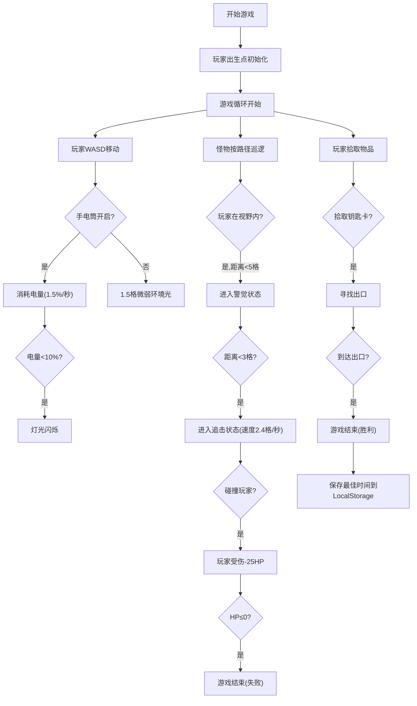

## 1. 产品概述

废弃精神病院生存恐怖游戏 - 玩家在黑暗环境中搜集钥匙卡逃离，同时躲避徘徊的怪物。

- 核心目标：为玩家提供紧张刺激的恐怖生存体验，融合资源管理、潜行躲避和探索元素
- 目标用户：恐怖游戏爱好者、独立游戏玩家、浏览器游戏玩家

## 2. 核心功能

### 2.2 功能模块

1. **游戏主界面**：Canvas游戏画布、手电筒光照效果、HUD显示（生命值、电量、游戏时间）
2. **玩家系统**：WASD移动控制、手电筒开关、生命值与电量管理、受伤无敌机制
3. **怪物AI系统**：巡逻、警觉、追击三种状态转换、路径寻路、视野检测
4. **物品交互系统**：电池拾取、医疗包拾取、钥匙卡获取、出口逃脱判定
5. **音效系统**：Web Audio API生成拾取音效、怪物心跳声、受伤音效
6. **进度系统**：LocalStorage保存最佳逃脱时间、胜利/失败画面展示

### 2.3 页面详情

| 页面名称 | 模块名称 | 功能描述 |
|-----------|-------------|---------------------|
| 游戏主界面 | 游戏画布 | 40x30网格地图、俯视视角渲染、手电筒锥形光照、环境光晕 |
| 游戏主界面 | HUD面板 | 生命值条、电量条、实时计时器、操作提示文字 |
| 游戏主界面 | 视觉特效 | 受伤时红色血迹边框、怪物接近时屏幕扭曲效果 |
| 开始画面 | 开始菜单 | 游戏标题、操作说明、开始游戏按钮 |
| 胜利画面 | 结果展示 | 显示逃脱用时、最佳纪录、重新开始按钮 |
| 失败画面 | 结果展示 | 显示"你死了"文字、死亡时间、重新开始按钮 |

## 3. 核心流程

## 4. 用户界面设计

### 4.1 设计风格

- **主色调**：深黑色(#0a0a0a)背景，营造黑暗压抑的恐怖氛围
- **辅助色**：暗红色(#8b0000)用于伤害提示、深绿色(#006400)用于生命值、亮黄色(#ffff00)用于手电筒
- **字体**：使用'Courier New'等宽字体，配合像素风格增强复古恐怖感
- **布局**：全屏Canvas占据主要区域，HUD元素悬浮在四角
- **视觉特效**：
  - 手电筒锥形径向渐变光照
  - 低电量时灯光随机闪烁
  - 受伤时红色边框渐变扩散
  - 怪物接近时屏幕边缘扭曲效果（CSS filter: blur和contrast组合）

### 4.2 页面设计概述

| 页面名称 | 模块名称 | UI元素 |
|-----------|-------------|-------------|
| 游戏主界面 | 游戏画布 | 暗黑背景、网格地图、手电筒锥形光照、玩家(白色方块)、怪物(红色方块)、物品(彩色图标) |
| 游戏主界面 | HUD面板 | 左上角：绿色生命值条；右上角：黄色电量条；右下角：白色计时器 |
| 游戏主界面 | 视觉特效 | 受伤时红色血迹边框动画；怪物警觉时屏幕边缘模糊抖动 |
| 开始/结束画面 | 覆盖层 | 半透明黑色背景、居中白色大字体文字、底部按钮 |

### 4.3 响应式

- 采用固定尺寸Canvas(800x600)，在不同屏幕尺寸下居中显示
- HUD元素使用相对定位，保持在画布四角
- 不支持移动端触摸操作，专为桌面端键盘鼠标设计

### 4.4 2D游戏场景设计

- **视角**：俯视视角(top-down)，固定相机跟随玩家
- **光照**：手电筒为锥形径向渐变（从中心黄到边缘透明），外部区域接近全黑
- **地图**：40x30网格，至少6个房间通过走廊连接，墙壁厚度1格
- **氛围**：通过有限视野、灯光闪烁、音效节奏变化营造心理恐怖感
