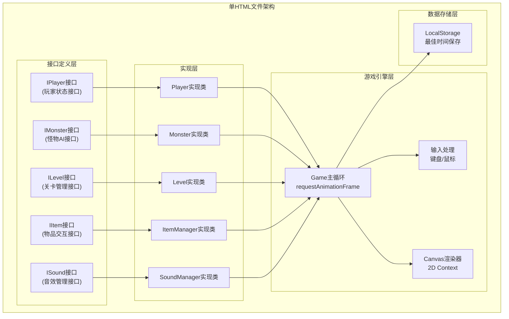

## 1. 架构设计



## 2. 技术描述

- **前端技术栈**：纯HTML5 + CSS3 + Vanilla JavaScript (ES6+)
- **渲染引擎**：HTML5 Canvas 2D Context
- **音效系统**：Web Audio API (Oscillator节点)
- **数据存储**：浏览器LocalStorage
- **模块化方案**：单HTML内<script>标签分块，通过接口隔离实现
- **构建工具**：无需构建，直接浏览器打开运行

## 3. 模块接口定义

### 3.1 玩家状态接口 (IPlayer)
```javascript
// 接口定义
const IPlayer = {
  getPosition: () => ({ x, y }),
  getHealth: () => number,
  getBattery: () => number,
  isFlashlightOn: () => boolean,
  isMoving: () => boolean,
  takeDamage: (amount) => void,
  heal: (amount) => void,
  consumeBattery: (delta) => void,
  rechargeBattery: (amount) => void,
  toggleFlashlight: () => void,
  move: (dx, dy, deltaTime) => void,
  update: (deltaTime) => void,
  isInvincible: () => boolean
};
```

### 3.2 怪物AI接口 (IMonster)
```javascript
// 接口定义
const IMonster = {
  getPosition: () => ({ x, y }),
  getState: () => 'patrol' | 'alert' | 'chase',
  getDirection: () => number,
  update: (player, level, deltaTime) => void,
  checkCollision: (playerPos) => boolean,
  reset: () => void
};
```

### 3.3 关卡管理接口 (ILevel)
```javascript
// 接口定义
const ILevel = {
  getMapData: () => number[][],
  getMapSize: () => ({ width, height }),
  getPlayerSpawn: () => ({ x, y }),
  getExitPosition: () => ({ x, y }),
  getMonsterPatrolPath: () => [{ x, y }],
  getItemPositions: () => ({ batteries, medkits, keycard }),
  isWall: (x, y) => boolean,
  hasLineOfSight: (pos1, pos2) => boolean,
  getCellSize: () => number
};
```

### 3.4 物品交互接口 (IItemManager)
```javascript
// 接口定义
const IItemManager = {
  checkPickup: (playerPos, keyPressed) => itemType | null,
  hasKeycard: () => boolean,
  getItems: () => ({ batteries, medkits, keycard }),
  getNearbyItem: (playerPos) => item | null,
  reset: () => void
};
```

### 3.5 音效管理接口 (ISoundManager)
```javascript
// 接口定义
const ISoundManager = {
  playPickup: () => void,
  playHeartbeat: (intensity) => void,
  playDamage: () => void,
  stopHeartbeat: () => void,
  init: () => void
};
```

## 4. 核心常量定义

| 常量名 | 值 | 说明 |
|--------|-----|------|
| MAP_WIDTH | 40 | 地图宽度(格) |
| MAP_HEIGHT | 30 | 地图高度(格) |
| CELL_SIZE | 20 | 每格像素数 |
| PLAYER_SPEED_ON | 3 | 手电筒开启时移动速度(格/秒) |
| PLAYER_SPEED_OFF | 2 | 手电筒关闭时移动速度(格/秒) |
| BATTERY_DRAIN | 1.5 | 电量消耗(%/秒) |
| BATTERY_RECHARGE | 35 | 电池恢复电量(%) |
| HEALTH_PACK | 40 | 医疗包恢复生命值 |
| MONSTER_SPEED_PATROL | 0.8 | 巡逻速度(格/秒) |
| MONSTER_SPEED_CHASE | 2.4 | 追击速度(格/秒) |
| ALERT_RANGE | 5 | 警觉距离(格) |
| CHASE_RANGE | 3 | 追击距离(格) |
| ESCAPE_RANGE | 8 | 脱离追击距离(格) |
| FLASHLIGHT_CONE | 60 | 手电筒锥形角度(度) |
| AMBIENT_LIGHT_RADIUS | 1.5 | 环境光半径(格) |
| INVINCIBLE_TIME | 0.75 | 无敌时间(秒) |

## 5. 游戏循环时序

```mermaid
sequenceDiagram
    participant Loop as requestAnimationFrame
    participant Input as InputHandler
    participant Player as Player模块
    participant Monster as Monster模块
    participant Items as ItemManager模块
    participant Sound as SoundManager模块
    participant Render as Renderer模块
    
    Loop->>Input: 读取键盘/鼠标状态
    Input->>Player: 传递移动输入
    Player->>Player: 更新位置、电量、无敌时间
    
    Loop->>Monster: 更新怪物AI
    Monster->>Player: 获取玩家位置
    Monster->>Sound: 根据状态播放心跳声
    
    Loop->>Items: 检测物品拾取
    Items->>Player: 应用拾取效果
    Items->>Sound: 播放拾取音效
    
    Monster->>Player: 碰撞检测
    Player->>Player: 受伤扣血
    Player->>Sound: 播放受伤音效
    Player->>Render: 触发血迹特效
    
    Loop->>Render: 渲染场景
    Render->>Player: 绘制玩家、手电筒
    Render->>Monster: 绘制怪物
    Render->>Items: 绘制物品
    Render->>Render: 应用后处理特效
    
    Player->>Loop: 检查死亡/胜利条件
```

## 6. 地图数据结构

地图使用二维数组定义：
- 0: 可通行区域
- 1: 墙壁
- 2: 玩家出生点
- 3: 出口
- 4: 电池刷新点
- 5: 医疗包刷新点
- 6: 钥匙卡位置

至少包含6个房间，通过走廊连接。
