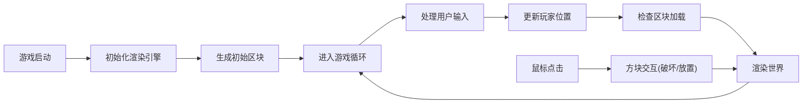

## 1. 产品概述

2D俯视角无限方块世界沙盒游戏原型，支持程序化地形生成、玩家移动、方块放置与破坏，具备区块加载卸载机制。

- 核心目标：提供一个可扩展的开放式沙盒世界体验
- 目标用户：游戏开发者、技术爱好者、沙盒游戏玩家

## 2. 核心功能

### 2.1 功能模块

1. **核心渲染系统**：Canvas 2D渲染，800×600像素画布，16×16像素方块
2. **世界生成系统**：程序化地形生成，草地、沙地、水域三种地形
3. **玩家控制系统**：WASD移动，每秒不低于6个方块速度
4. **方块交互系统**：左键破坏、右键放置，数字键1-3切换方块类型
5. **区块管理系统**：16×16方块为区块单位，动态加载卸载3×3区块范围

### 2.2 功能详情

| 功能模块 | 子功能 | 详细描述 |
|---------|--------|---------|
| 世界生成 | 地形生成 | 使用噪声算法生成连绵地形，区分草地、沙地、水域 |
| 世界生成 | 区块系统 | 16×16区块，动态加载卸载，范围3×3 |
| 玩家控制 | 移动 | WASD控制，每秒≥6方块速度，相机跟随 |
| 方块交互 | 破坏 | 左键点击脚下方块，方块消失变为空气 |
| 方块交互 | 放置 | 右键相邻空气位置放置选中方块 |
| 方块交互 | 选择栏 | 草地、沙地、石块三种，数字键1-3快速切换 |
| 视觉反馈 | 破坏特效 | 即时视觉反馈效果 |
| 视觉反馈 | 放置特效 | 确认感视觉效果 |
| 边界处理 | 世界边界 | 平滑限制玩家位置，防止卡死 |
| 边界处理 | 未加载区块 | 显示占位样式，生成后自动替换 |

## 3. 核心流程

## 4. 用户界面设计

### 4.1 设计风格

- 主色调：像素风格，自然色系（绿色草地、黄色沙地、蓝色水域）
- 界面风格：复古像素风，简洁实用
- 字体：等宽像素字体
- 布局：全屏Canvas，顶部HUD显示当前方块选择和坐标信息

### 4.2 界面设计概述

| 界面元素 | 位置 | 样式说明 |
|---------|------|---------|
| 主画布 | 中央 | 800×600像素，黑色背景 |
| 方块选择栏 | 底部 | 三个方块预览，高亮选中项 |
| 坐标信息 | 左上角 | 显示玩家世界坐标 |
| 提示文字 | 右上角 | 操作说明(WASD移动, 左右键交互) |

### 4.3 性能要求

- 启动时间：≤2秒
- 帧率：稳定60fps
- 内存管理：连续移动5分钟帧率不低于30fps
- 状态保持：修改过的方块状态正确保存和恢复
