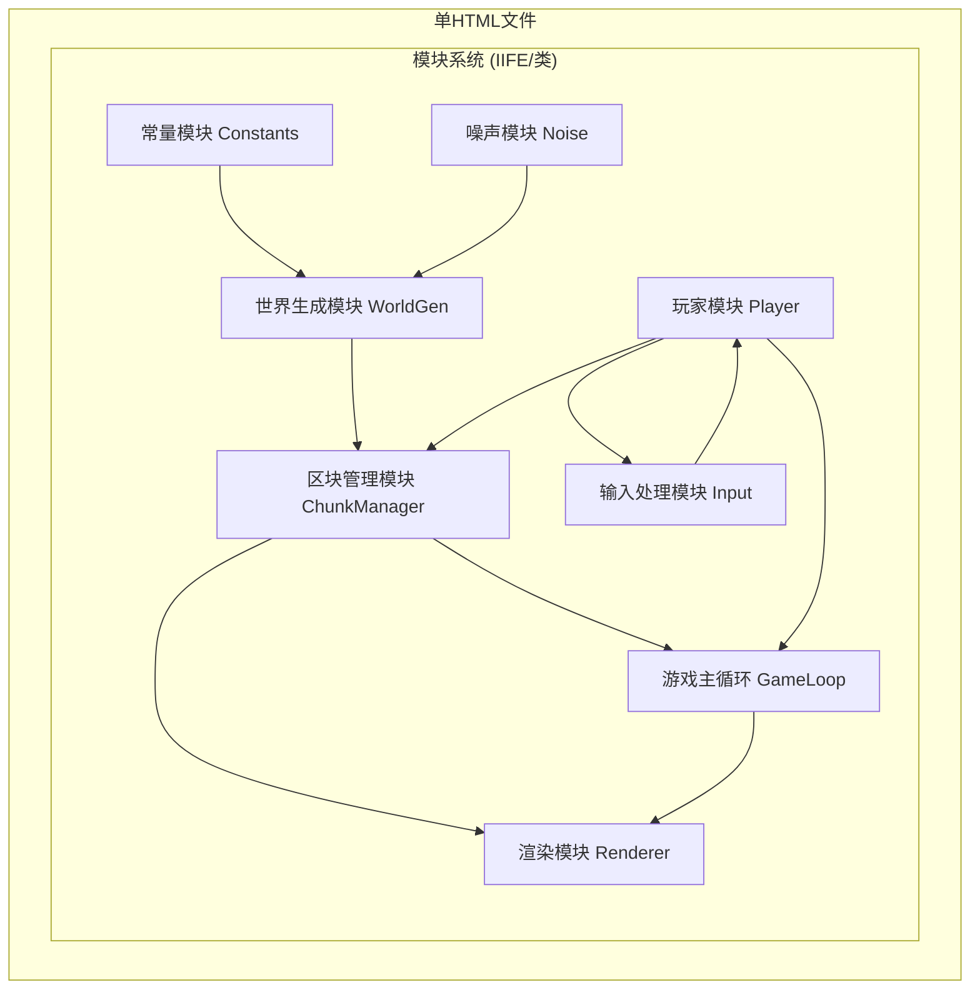

## 1. 架构设计



## 2. 技术描述

- 前端技术：纯HTML5 + Canvas 2D API + 原生JavaScript (ES6+)
- 架构模式：单文件多模块，使用IIFE和类模拟模块隔离
- 外部依赖：无（纯原生实现，零依赖）
- 性能优化：区块动态加载卸载、对象池、增量渲染

## 3. 模块设计

### 3.1 模块划分

| 模块名称 | 职责 | 对外接口 |
|---------|------|---------|
| Constants | 定义游戏常量 | BLOCK_SIZE, CHUNK_SIZE, TILE_TYPES等 |
| Noise | 2D Simplex噪声实现 | noise2D(x, y) |
| WorldGen | 地形生成算法 | generateTerrain(x, y) |
| ChunkManager | 区块加载卸载管理 | getBlock(), setBlock(), updateChunks() |
| Player | 玩家状态与移动 | update(), getPosition(), setPosition() |
| Input | 键盘鼠标输入处理 | isKeyDown(), getMousePos() |
| Renderer | Canvas渲染 | renderWorld(), renderUI() |
| GameLoop | 主游戏循环 | start(), stop() |

### 3.2 核心数据结构

```javascript
// 方块类型定义
const TILE_TYPES = {
  AIR: 0,
  GRASS: 1,
  SAND: 2,
  WATER: 3,
  STONE: 4
};

// 区块数据结构
class Chunk {
  x: number;      // 区块坐标
  y: number;
  blocks: Uint8Array;  // 16x16方块数据
  modified: Set;  // 被修改的方块位置
}

// 玩家状态
class Player {
  worldX: number;
  worldY: number;
  selectedTile: number;
  speed: number;
}
```

## 4. 关键算法

### 4.1 程序化地形生成

使用多层Simplex噪声叠加：
- 基础噪声决定主要地形特征
- 细节噪声增加地形变化
- 阈值划分不同地形类型

### 4.2 区块管理策略

- 玩家所在区块为中心，3×3范围加载
- 超出范围的区块延迟卸载
- 修改过的区块数据持久化保存在Map中

### 4.3 碰撞检测

- 水域方块不可穿越
- 移动前预计算下一位置
- 边界检测限制玩家位置
