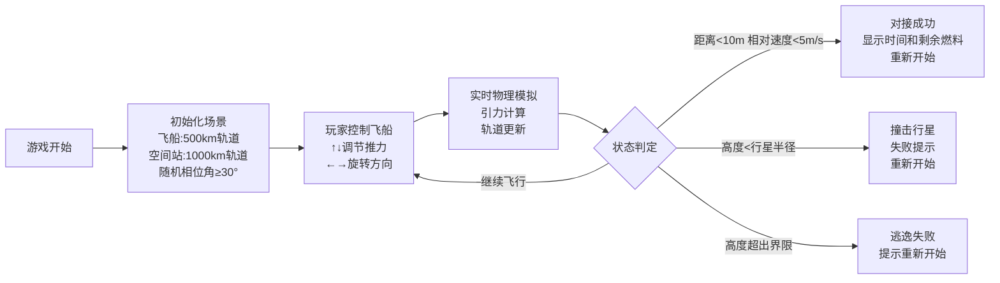

## 1. 产品概述

太空轨道对接游戏是一款基于真实物理轨道力学的2D模拟游戏，玩家通过键盘控制飞船推力和方向，在行星引力场中进行轨道机动，最终与目标空间站完成精准对接。

- 核心目标：提供具有挑战性的轨道力学模拟体验，让玩家体验真实的太空对接操作
- 目标用户：航天爱好者、物理模拟游戏玩家

## 2. 核心功能

### 2.1 功能模块
1. **游戏主界面**：Canvas实时渲染、轨道预测、飞行轨迹
2. **物理引擎**：二维牛顿万有引力、轨道力学计算
3. **飞船控制系统**：推力调节、方向旋转、燃料消耗
4. **HUD显示**：速度、高度、燃料、距离、相对速度
5. **游戏状态管理**：成功/失败判定、重新开始

### 2.2 页面详情
| 页面名称 | 模块名称 | 功能描述 |
|---------|---------|---------|
| 游戏主页面 | Canvas渲染 | 行星、空间站、飞船、轨道线、轨迹绘制 |
| 游戏主页面 | HUD界面 | 实时显示飞行参数和状态信息 |
| 游戏主页面 | 状态弹窗 | 对接成功/失败提示、重新开始按钮 |

## 3. 核心流程

## 4. 用户界面设计

### 4.1 设计风格
- **主色调**：深邃太空背景（黑色/深蓝），行星（蓝色），空间站（灰色），飞船（白色/红色）
- **视觉元素**：简约几何图形，科技感十足
- **字体**：等宽字体，确保HUD数据清晰对齐
- **布局**：Canvas全屏显示，HUD位于左上角不遮挡游戏画面

### 4.2 页面设计概览
| 页面名称 | 模块名称 | UI元素 |
|---------|---------|--------|
| 游戏主页面 | Canvas场景 | 黑色星空背景、蓝色行星、灰色六边形空间站、三角形飞船、白色虚线轨道、红色实线路径 |
| 游戏主页面 | HUD | 半透明背景、白色文字、显示速度/高度/燃料/距离/相对速度 |
| 游戏主页面 | 状态弹窗 | 居中显示、半透明背景、成功/失败提示、重新开始按钮 |

### 4.3 响应式
- Canvas自适应窗口大小，窗口改变时自动重绘
- 保持图形比例，避免变形
- HUD位置固定，不随窗口缩放而偏移
