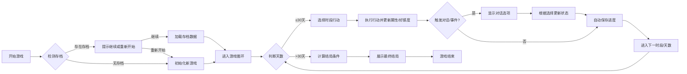

## 1. 产品概述
校园背景文字恋爱养成游戏，玩家通过30天的日程安排提升角色属性和好感度，最终达成不同结局。
- 核心玩法：回合制日程管理、多角色对话互动、礼物赠送、事件触发
- 目标：提供沉浸式恋爱养成体验，包含丰富的剧情分支和多重结局

## 2. 核心功能

### 2.1 用户角色
| 角色 | 描述 | 核心权限 |
|------|------|----------|
| 玩家 | 游戏主角，高中学生 | 执行日程安排、对话选择、礼物赠送、查看角色情报 |

### 2.2 功能模块
1. **主游戏界面**：角色状态面板、日程行动区、对话展示区、日志记录栏
2. **角色系统**：3名可攻略角色，包含立绘、好感度、性格标签、背景故事
3. **日程系统**：每天3个时段（上午/下午/晚上），多种行动选择（学习/打工/聊天/送礼/休息）
4. **礼物系统**：商店购买礼物，不同角色对礼物有不同偏好
5. **对话事件**：基于好感度区间和属性触发不同对话分支，含选项分支
6. **存档系统**：localStorage自动保存，支持版本兼容
7. **结局系统**：30天后根据好感度和属性判定结局

### 2.3 页面详情
| 页面名称 | 模块名称 | 功能描述 |
|----------|----------|----------|
| 主游戏界面 | 角色状态面板 | 显示主角属性（学识/魅力/体力）、金钱、各角色好感度进度条 |
| 主游戏界面 | 日程行动区 | 显示当前时段、行动按钮、对话内容、选项分支 |
| 主游戏界面 | 角色情报面板 | 可折叠面板，展示角色已解锁背景信息 |
| 主游戏界面 | 日历视图 | 显示当前日期、时段、过去行动摘要 |
| 主游戏界面 | 商店界面 | 礼物购买、库存管理 |
| 主游戏界面 | 结局展示 | 30天结束时展示最终结局文字和角色表态 |

## 3. 核心流程
玩家开始游戏 → 检测存档并提示是否继续 → 进入每日循环（3个时段）→ 选择行动 → 执行行动并更新状态 → 触发对话/事件 → 第30天结束 → 计算并展示结局

## 4. 用户界面设计
### 4.1 设计风格
- **主色调**：樱花粉（#FFB7C5）为主，搭配淡蓝色（#B7D8FF），营造校园恋爱氛围
- **按钮风格**：圆角矩形，带有hover效果，点击时有微妙缩放动画
- **字体**：使用系统无衬线字体，标题使用优雅的衬线字体样式
- **布局风格**：三栏式布局（左侧状态面板、右侧主内容区、底部日志栏）
- **图标**：使用Unicode字符和CSS绘制的简单图形

### 4.2 页面设计概述
| 页面名称 | 模块名称 | UI元素 |
|----------|----------|--------|
| 主游戏界面 | 角色状态面板 | 属性进度条（带平滑动画）、角色立绘（CSS绘制）、好感度数值、颜色编码 |
| 主游戏界面 | 日程行动区 | 时段标签、行动按钮网格、对话文本框、选项按钮列表 |
| 主游戏界面 | 角色情报面板 | 可折叠手风琴效果、角色卡片、背景故事分段显示 |
| 主游戏界面 | 日历视图 | 小型日历网格、日期高亮、行动历史记录tooltip |
| 主游戏界面 | 商店界面 | 礼物卡片网格、价格标签、库存数量显示、购买按钮 |

### 4.3 响应式
- 桌面端：三栏式布局，固定宽度侧边栏
- 移动端：堆叠式布局，使用媒体查询自适应

### 4.4 动画效果
- 好感度进度条变化：0.5秒平滑过渡动画
- 按钮悬停：颜色渐变+轻微上移效果
- 面板展开/折叠：高度过渡动画
- 对话出现：淡入+轻微下滑动画
- 特殊事件触发：闪光效果+背景色变化

---
**文档版本**: v1.0  
**创建日期**: 2026-05-19
