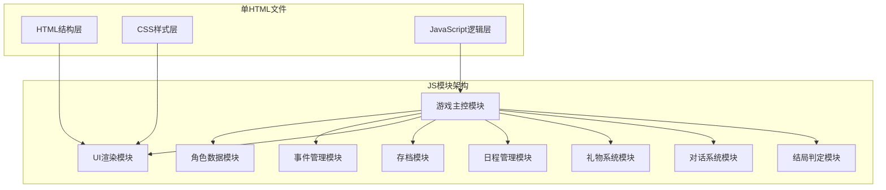

## 1. 架构设计
单HTML文件架构，使用IIFE（立即执行函数）实现模块隔离，各模块通过暴露的接口进行通信。



## 2. 技术栈说明
- **前端**：纯HTML5 + CSS3 + Vanilla JavaScript (ES6+)
- **数据存储**：localStorage
- **无外部依赖**：所有图标、图形使用CSS绘制或Unicode字符

## 3. 模块接口定义

### 3.1 角色数据模块 (CharacterModule)
```javascript
interface Character {
    id: string;
    name: string;
    avatar: string; // CSS class name for drawing
    personality: string[];
    background: { unlocked: boolean; text: string }[];
    affection: number; // 0-100
    giftCooldown: number; // 礼物冷却时段数
    chatCooldown: number; // 连续聊天冷却计数
}

interface CharacterModule {
    getCharacter(id: string): Character;
    getAllCharacters(): Character[];
    updateAffection(id: string, delta: number): void;
    setGiftCooldown(id: string, cooldown: number): void;
    decrementCooldowns(): void;
    unlockBackground(id: string, index: number): void;
}
```

### 3.2 玩家数据模块 (PlayerModule)
```javascript
interface PlayerStats {
    knowledge: number; // 学识 0-100
    charm: number;     // 魅力 0-100
    stamina: number;   // 体力 0-100
    money: number;     // 金钱
}

interface PlayerModule {
    getStats(): PlayerStats;
    updateStats(delta: Partial<PlayerStats>): void;
    getInventory(): { [giftId: string]: number };
    addToInventory(giftId: string, quantity: number): void;
    removeFromInventory(giftId: string, quantity: number): boolean;
}
```

### 3.3 日程管理模块 (ScheduleModule)
```javascript
interface GameTime {
    day: number;      // 1-30
    period: number;   // 0-2 (上午/下午/晚上)
}

interface Action {
    id: string;
    name: string;
    description: string;
    execute: () => ActionResult;
}

interface ActionResult {
    success: boolean;
    message: string;
    statsChange?: Partial<PlayerStats>;
    affectionChange?: { characterId: string; delta: number }[];
    triggerDialogue?: { characterId: string; dialogueType: string };
}

interface ScheduleModule {
    getCurrentTime(): GameTime;
    getAvailableActions(): Action[];
    executeAction(actionId: string, params?: any): ActionResult;
    advanceTime(): void;
    isGameOver(): boolean;
    getActionHistory(): { day: number; period: number; action: string }[];
}
```

### 3.4 礼物系统模块 (GiftModule)
```javascript
interface Gift {
    id: string;
    name: string;
    description: string;
    price: number;
    preference: { [characterId: string]: number }; // 好感度加成
}

interface GiftModule {
    getAllGifts(): Gift[];
    getGift(giftId: string): Gift | undefined;
    buyGift(giftId: string): { success: boolean; message: string };
    giveGift(characterId: string, giftId: string): { success: boolean; message: string; affectionGain: number };
    canGiveGift(characterId: string): boolean;
}
```

### 3.5 对话系统模块 (DialogueModule)
```javascript
interface DialogueOption {
    text: string;
    affectionChange?: number;
    statsChange?: Partial<PlayerStats>;
    nextDialogue?: string;
    unlocksBackground?: { characterId: string; index: number };
}

interface Dialogue {
    id: string;
    characterId: string;
    affectionRange: [number, number]; // [min, max]
    requiredStats?: Partial<PlayerStats>;
    text: string;
    options: DialogueOption[];
}

interface DialogueModule {
    getDialogue(characterId: string, affection: number, stats: PlayerStats): Dialogue | undefined;
    selectOption(dialogue: Dialogue, optionIndex: number): {
        message: string;
        affectionChange: number;
        statsChange: Partial<PlayerStats>;
    };
}
```

### 3.6 存档模块 (SaveModule)
```javascript
interface SaveData {
    version: number;
    timestamp: number;
    gameTime: GameTime;
    player: {
        stats: PlayerStats;
        inventory: { [giftId: string]: number };
    };
    characters: Character[];
    actionHistory: any[];
    triggeredEvents: string[];
    consecutiveActions: { [actionId: string]: number };
}

interface SaveModule {
    SAVE_VERSION: number;
    save(data: Omit<SaveData, 'version' | 'timestamp'>): void;
    load(): SaveData | null;
    hasSave(): boolean;
    clearSave(): void;
    isValidVersion(data: any): boolean;
}
```

### 3.7 事件管理模块 (EventModule)
```javascript
interface SpecialEvent {
    id: string;
    name: string;
    checkCondition: (gameState: any) => boolean;
    trigger: () => { message: string; rewards?: any };
}

interface EventModule {
    checkAndTriggerEvents(): SpecialEvent[];
    markTriggered(eventId: string): void;
    hasTriggered(eventId: string): boolean;
}
```

### 3.8 结局判定模块 (EndingModule)
```javascript
interface Ending {
    id: string;
    type: 'single' | 'friend' | 'lonely';
    characterId?: string;
    title: string;
    description: string;
    characterQuote?: string;
}

interface EndingModule {
    calculateEnding(): Ending;
    getAllPossibleEndings(): Ending[];
}
```

### 3.9 UI渲染模块 (UIModule)
```javascript
interface UIModule {
    renderPlayerStats(stats: PlayerStats): void;
    renderCharacters(characters: Character[]): void;
    renderGameTime(time: GameTime): void;
    renderActions(actions: Action[]): void;
    renderDialogue(dialogue: Dialogue): void;
    renderLog(message: string): void;
    renderInventory(inventory: any): void;
    renderShop(gifts: Gift[]): void;
    renderEnding(ending: Ending): void;
    renderCalendar(history: any[]): void;
    toggleCharacterInfo(): void;
    toggleShop(): void;
    showSavePrompt(): Promise<boolean>;
    animateAffectionBar(characterId: string): void;
}
```

## 4. 数据结构定义

### 4.1 初始角色数据
```javascript
// 3名可攻略角色初始数据
const INITIAL_CHARACTERS = [
    {
        id: 'sakura',
        name: '樱井美咲',
        avatar: 'sakura-avatar',
        personality: ['温柔', '文艺', '书虫'],
        affection: 0,
        giftCooldown: 0,
        chatCooldown: 0,
        background: [
            { unlocked: true, text: '文学社社长，喜欢在图书馆度过闲暇时光。' },
            { unlocked: false, text: '表面文静，内心却有着不为人知的秘密...' },
            { unlocked: false, text: '其实一直暗恋着主角，但不敢表达。' }
        ]
    },
    // 另外两个角色...
];
```

### 4.2 礼物数据
```javascript
// 至少5种礼物
const GIFTS = [
    { id: 'flower', name: '鲜花', price: 50, preference: { sakura: 8, yuki: 5, aoi: 3 } },
    { id: 'book', name: '名著', price: 80, preference: { sakura: 12, yuki: 4, aoi: 6 } },
    { id: 'chocolate', name: '巧克力', price: 30, preference: { sakura: 5, yuki: 10, aoi: 7 } },
    { id: 'cd', name: '音乐CD', price: 100, preference: { sakura: 3, yuki: 15, aoi: 5 } },
    { id: 'ticket', name: '电影票', price: 120, preference: { sakura: 10, yuki: 8, aoi: 12 } }
];
```

## 5. 核心算法逻辑

### 5.1 好感度区间判定
- 低好感度：0-30
- 中好感度：31-60
- 高好感度：61-100

### 5.2 结局判定条件
1. **单人结局**：任一角色好感度 ≥ 80，取好感度最高者
2. **友情结局**：所有角色好感度 ≥ 60 但 < 80
3. **孤单结局**：所有角色好感度 < 60

### 5.3 特殊事件触发条件（隐藏逻辑）
- 连续3天选择同一行动触发特殊事件
- 好感度达到特定阈值时触发隐藏剧情
- 主角属性达到一定值时解锁特殊对话

---
**文档版本**: v1.0  
**创建日期**: 2026-05-19
