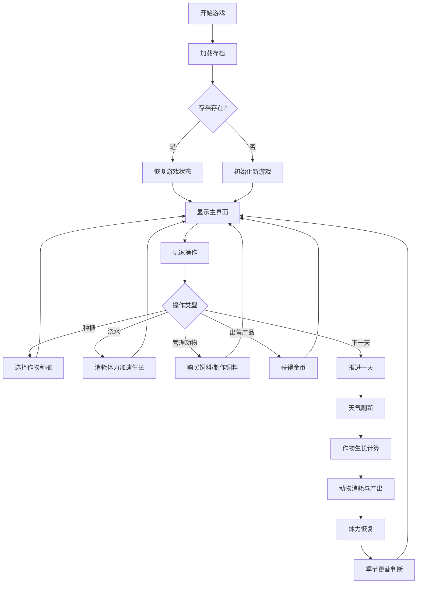

## 1. 产品概述

农场模拟游戏是一款单页面浏览器游戏，玩家通过种植作物、饲养动物来经营自己的农场，体验田园生活的乐趣。
- 核心玩法：种植作物、浇水管理、饲养动物、出售产品获得金币
- 目标价值：提供轻松愉快的模拟经营体验，包含天气、季节等随机要素增加游戏趣味性

## 2. 核心功能

### 2.1 用户角色
无角色区分，单玩家模式。

### 2.2 功能模块
1. **主游戏界面**：6x6农田网格、状态面板、操作按钮
2. **作物系统**：种植、生长、收获、枯萎机制
3. **天气系统**：晴天/雨天/干旱随机生成，影响作物生长
4. **季节系统**：春夏秋冬四季，影响可种植作物种类
5. **体力系统**：浇水消耗体力，每日自动恢复
6. **动物系统**：鸡和牛饲养、饲料消耗、产品产出
7. **自动化设施**：灌溉装置、自动喂食器升级系统
8. **存档系统**：localStorage持久化存储游戏状态

### 2.3 页面详情
| 页面名称 | 模块名称 | 功能描述 |
|-----------|-------------|---------------------|
| 主游戏页面 | 农田网格 | 6x6格子显示，点击可种植/收获作物，显示生长进度 |
| 主游戏页面 | 状态面板 | 显示天气、季节、天数、金币、体力值 |
| 主游戏页面 | 动物面板 | 显示鸡/牛数量、饲料存量、鸡蛋/牛奶库存 |
| 主游戏页面 | 操作面板 | 种植选择、浇水、购买饲料、制作饲料、出售产品、下一天、升级设施 |
| 主游戏页面 | 提示区域 | 显示操作反馈和重要提示信息 |

## 3. 核心流程

玩家进入游戏 → 加载存档（或新游戏）→ 查看当前状态 → 种植作物/浇水/管理动物 → 点击"下一天"推进时间 → 天气/季节变化 → 作物生长/动物产出 → 收获产品出售 → 升级设施 → 继续游戏循环

## 4. 用户界面设计

### 4.1 设计风格
- **主色调**：绿色系（#4CAF50、#81C784）代表农田生机，搭配土黄色（#8D6E63）代表土地
- **辅助色**：天蓝色（#64B5F6）代表天气相关元素，金色（#FFD54F）代表金币
- **按钮风格**：圆角矩形，带有轻微阴影和悬停效果
- **字体**：使用系统无衬线字体，标题加粗，正文清晰易读
- **布局风格**：卡片式布局，农田居中，状态面板环绕
- **图标风格**：使用emoji表情作为图标，直观生动

### 4.2 页面设计概述
| 页面名称 | 模块名称 | UI元素 |
|-----------|-------------|-------------|
| 主游戏页面 | 农田网格 | 6x6方格布局，不同状态显示不同颜色和emoji，悬停高亮，生长进度条 |
| 主游戏页面 | 状态面板 | 横向排列，图标+数值显示，天气emoji动态显示 |
| 主游戏页面 | 动物面板 | 卡片形式，动物emoji展示，进度条显示饥饿状态 |
| 主游戏页面 | 操作面板 | 按钮组排列，重要按钮（下一天）突出显示 |
| 主游戏页面 | 提示区域 | 固定底部，浅色背景，消息滚动显示 |

### 4.3 响应性
- 桌面端优先设计，适配常见分辨率
- 使用CSS Grid和Flexbox实现自适应布局
- 按钮和可点击区域确保足够大，便于操作

### 4.4 动画效果
- 作物生长时的轻微放大动画
- 收获产品时的弹跳效果
- 天气变化的淡入淡出过渡
- 按钮点击的缩放反馈
- 提示消息的滑入动画
