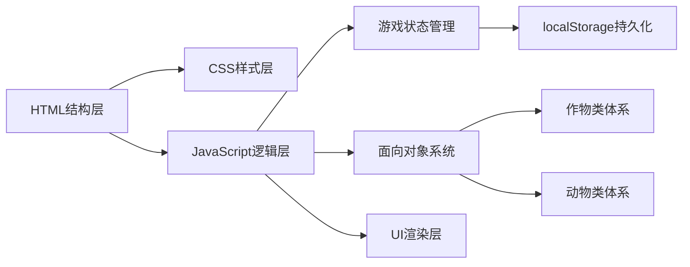

## 1. 架构设计



## 2. 技术描述

- **前端技术栈**：原生 HTML5 + CSS3 + JavaScript ES6+
- **构建工具**：无需构建工具，单文件直接运行
- **数据存储**：浏览器 localStorage 本地存储
- **架构模式**：面向对象 + 模块化组织

## 3. 文件结构

| 文件 | 用途 |
|-------|---------|
| index.html | 唯一入口文件，包含HTML结构、CSS样式、JavaScript代码 |

## 4. 核心类设计

### 4.1 作物接口与实现

```javascript
// 作物接口（约定）
interface ICrop {
    name: string;
    growTime: number;
    sellPrice: number;
    currentGrowth: number;
    watered: boolean;
    
    grow(weather: string): void;
    harvest(): number;
    water(): void;
    isMature(): boolean;
    isWithered(): boolean;
}

// 具体作物类
class Wheat implements ICrop { ... }
class Corn implements ICrop { ... }
class Tomato implements ICrop { ... }
```

### 4.2 动物接口与实现

```javascript
// 动物接口（约定）
interface IAnimal {
    type: string;
    count: number;
    feedConsumption: number;
    productName: string;
    productPrice: number;
    hungryDays: number;
    
    consumeFeed(availableFeed: number): number;
    produce(): { product: string, amount: number };
    isHungry(): boolean;
}

// 具体动物类
class Chicken implements IAnimal { ... }
class Cow implements IAnimal { ... }
```

### 4.3 游戏主类

```javascript
class FarmGame {
    // 游戏状态
    gold: number;
    stamina: number;
    maxStamina: number;
    day: number;
    season: string;
    weather: string;
    
    // 地块数据
    plots: Array<Plot>;
    
    // 动物系统
    chicken: Chicken;
    cow: Cow;
    feed: number;
    eggs: number;
    milk: number;
    
    // 自动化设施
    irrigationLevel: number;
    feederLevel: number;
    
    // 核心方法
    nextDay(): void;
    plantCrop(plotIndex: number, cropType: string): boolean;
    waterCrop(plotIndex: number): boolean;
    harvestCrop(plotIndex: number): boolean;
    buyFeed(amount: number): boolean;
    makeFeed(cornAmount: number): boolean;
    sellProducts(): number;
    upgradeIrrigation(): boolean;
    upgradeFeeder(): boolean;
    saveGame(): void;
    loadGame(): boolean;
}
```

## 5. 数据模型

### 5.1 游戏状态存储结构

```javascript
{
  gold: number,
  stamina: number,
  maxStamina: number,
  day: number,
  season: string,
  weather: string,
  plots: [
    {
      crop: {
        type: string,
        currentGrowth: number,
        watered: boolean,
        matured: boolean
      } | null,
      frozen: boolean
    }
  ],
  feed: number,
  eggs: number,
  milk: number,
  cornInventory: number,
  chickenHungryDays: number,
  cowHungryDays: number,
  irrigationLevel: number,
  feederLevel: number
}
```

### 5.2 常量配置

```javascript
// 作物配置
const CROPS = {
  wheat: { growTime: 2, sellPrice: 15, seasons: ['spring', 'autumn'] },
  corn: { growTime: 3, sellPrice: 25, seasons: ['summer', 'autumn'] },
  tomato: { growTime: 4, sellPrice: 40, seasons: ['summer'] }
};

// 天气配置
const WEATHER = ['sunny', 'rainy', 'drought'];

// 季节配置
const SEASONS = ['spring', 'summer', 'autumn', 'winter'];
const DAYS_PER_SEASON = 7;

// 动物配置
const ANIMALS = {
  chicken: { feedPerDay: 1, product: 'egg', productPrice: 5 },
  cow: { feedPerDay: 2, product: 'milk', productPrice: 12 }
};

// 升级配置
const UPGRADES = {
  irrigation: [
    { level: 1, cost: 500, effect: '每天自动浇水1块地' },
    { level: 2, cost: 1000, effect: '每天自动浇水3块地' },
    { level: 3, cost: 2000, effect: '每天自动浇水全部地块' }
  ],
  feeder: [
    { level: 1, cost: 300, effect: '减少50%饲料消耗' },
    { level: 2, cost: 800, effect: '减少80%饲料消耗' },
    { level: 3, cost: 1500, effect: '饲料消耗为0' }
  ]
};
```

## 6. 核心算法

### 6.1 作物生长算法

```
输入: 当前天气、是否浇水过
1. 如果是干旱天气且未浇水 → 作物立即枯萎
2. 基础生长值 = 1 天
3. 如果是雨天 → 生长值 += 0.5 天
4. 更新作物当前生长进度
5. 如果生长进度 >= 成熟时间 → 标记为成熟
```

### 6.2 季节更替算法

```
1. 天数 + 1
2. 如果天数 > 每季天数 * 4 → 天数重置为 1
3. 计算当前季节索引 = (天数 - 1) / 每季天数 取整
4. 更新当前季节
5. 如果是冬季 → 所有地块冻结，无法种植
```

### 6.3 动物产出算法

```
输入: 饲料存量
1. 计算所需饲料量 = 动物数量 * 每只消耗量
2. 如果饲料足够:
   - 扣除饲料
   - 饥饿天数重置为 0
   - 产出正常数量产品
3. 否则如果饲料部分足够:
   - 扣除全部饲料
   - 饥饿天数 + 1
   - 产出减半
4. 否则:
   - 饥饿天数 + 1
   - 如果饥饿天数 >= 2 → 停止产出
```
