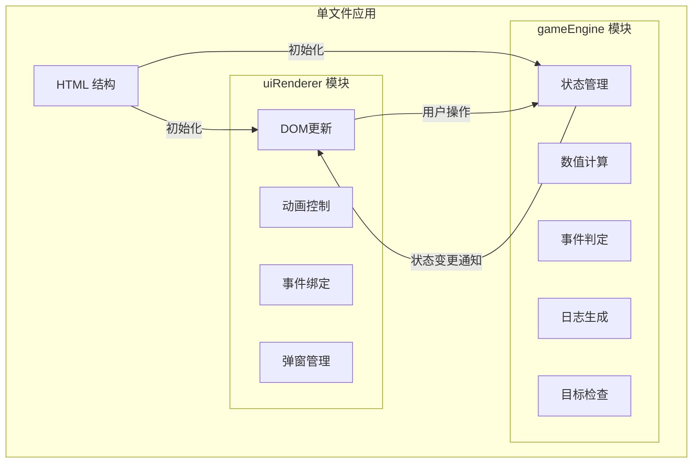

# UrbanHustle 技术架构文档

## 1. 架构设计



## 2. 技术说明

- **前端技术栈**：原生JavaScript (ES6+) + 原生CSS3 + HTML5
- **构建方式**：单文件HTML，所有代码内联
- **架构模式**：模块分离模式 (gameEngine + uiRenderer)
- **状态管理**：gameEngine内部闭包状态
- **动画实现**：CSS transitions + requestAnimationFrame

## 3. 模块接口定义

### 3.1 gameEngine 模块接口

```javascript
// 游戏引擎对外接口
const gameEngine = {
    // 初始化游戏
    initGame: () => GameState,
    
    // 执行行动
    performAction: (actionId: string) => ActionResult,
    
    // 获取当前状态
    getState: () => GameState,
    
    // 获取日志
    getLogs: () => LogEntry[],
    
    // 检查游戏是否结束
    isGameOver: () => boolean,
    
    // 获取游戏结果
    getGameResult: () => GameResult
};
```

### 3.2 uiRenderer 模块接口

```javascript
// UI渲染器对外接口
const uiRenderer = {
    // 初始化UI
    init: (engine: typeof gameEngine) => void,
    
    // 更新属性显示
    updateStats: (stats: Stats, prevStats: Stats) => void,
    
    // 更新行动按钮状态
    updateActions: (timeOfDay: string) => void,
    
    // 添加日志条目
    addLogEntry: (entry: LogEntry) => void,
    
    // 显示事件弹窗
    showEventPopup: (event: GameEvent) => void,
    
    // 显示结果弹窗
    showResultPopup: (result: GameResult) => void,
    
    // 更新天数显示
    updateDay: (day: number, timeOfDay: string) => void
};
```

## 4. 数据模型

### 4.1 游戏状态
```typescript
interface GameState {
    day: number;
    timeOfDay: 'morning' | 'afternoon' | 'night';
    stats: {
        money: number;
        energy: number;
        mood: number;
        network: number;
    };
    consecutiveZeroMoneyDays: number;
    target: GameTarget;
    isGameOver: boolean;
    logs: LogEntry[];
}
```

### 4.2 行动定义
```typescript
interface Action {
    id: string;
    name: string;
    description: string;
    availableIn: ('morning' | 'afternoon' | 'night')[];
    effects: {
        money: number;
        energy: number;
        mood: number;
        network: number;
    };
    exemptsDailyCost?: boolean;
}
```

### 4.3 事件定义
```typescript
interface GameEvent {
    id: string;
    name: string;
    description: string;
    type: 'positive' | 'negative' | 'neutral';
    effects: {
        money: number;
        energy: number;
        mood: number;
        network: number;
    };
}
```

### 4.4 目标定义
```typescript
interface GameTarget {
    id: string;
    name: string;
    description: string;
    type: 'money' | 'network' | 'combined';
    condition: (state: GameState) => boolean;
}
```

## 5. 核心算法

### 5.1 属性波动算法
```javascript
// 在基础值上添加 ±2 的随机浮动
function applyVariance(baseValue) {
    const variance = Math.floor(Math.random() * 5) - 2;
    return baseValue + variance;
}
```

### 5.2 随机事件判定
```javascript
// 30%概率触发随机事件
function checkRandomEvent() {
    return Math.random() < 0.3;
}
```

### 5.3 评价系统
```javascript
function calculateEvaluation(totalStats) {
    if (totalStats >= 350) return 'S';
    if (totalStats >= 280) return 'A';
    if (totalStats >= 200) return 'B';
    if (totalStats >= 120) return 'C';
    return 'D';
}
```

## 6. 文件结构

```
auto87/
└── index.html          # 单文件应用（包含HTML、CSS、JS）
```

## 7. 动画实现

### 7.1 数字滚动动画
- 使用 requestAnimationFrame 实现平滑数值过渡
- 动画时长：300ms
- 缓动函数：easeOutQuad

### 7.2 按钮悬停效果
- transform: translateY(-2px)
- box-shadow 增强
- transition: all 0.2s ease

### 7.3 弹窗动画
- opacity 从 0 到 1
- transform: scale(0.9) 到 scale(1)
- transition: all 0.3s ease
