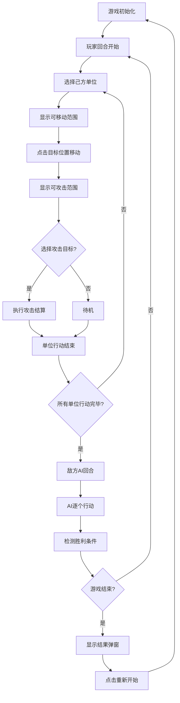

## 1. 产品概述

六边形网格回合制战棋游戏原型，使用纯HTML/CSS/JS实现，单文件内联代码，双击即可在浏览器中运行。
- 核心玩法：回合制策略战斗，包含单位移动、攻击、地形影响、单位特性和敌方AI
- 目标：展示完整的战棋游戏机制，为后续扩展提供基础框架

## 2. 核心功能

### 2.1 功能模块

1. **游戏主界面**：六边形网格地图、单位信息面板、控制按钮
2. **地图系统**：6列×9行六边形网格，四种地形（平原、森林、山地、水域）
3. **单位系统**：步兵、骑兵、弓兵三种单位类型，包含生命值、攻击力、移动范围等属性
4. **回合控制系统**：玩家回合→敌方AI回合循环切换
5. **战斗系统**：朝向加成、地形防御修正、骑兵冲锋技能
6. **AI系统**：基于BFS寻路的中等难度AI，具备基本战术判断

### 2.2 页面详情

| 页面名称 | 模块名称 | 功能描述 |
|---------|---------|---------|
| 游戏主界面 | 地图渲染模块 | Canvas绘制六边形网格，显示地形颜色和单位 |
| 游戏主界面 | 单位信息面板 | 选中单位时显示HP、攻击力、移动力等详细信息 |
| 游戏主界面 | 战斗日志区域 | 记录战斗过程中的攻击、伤害、单位死亡等事件 |
| 游戏主界面 | 控制按钮区 | 结束回合按钮、重置游戏按钮 |

## 3. 核心流程

## 4. 用户界面设计

### 4.1 设计风格
- **主色调**：深蓝色系（#1a365d）代表战场，绿色系（#2d5a27）代表地形
- **玩家单位**：蓝色（#3b82f6），敌方单位：红色（#ef4444）
- **按钮风格**：圆角矩形，悬停时有颜色变化和阴影效果
- **字体**：使用系统无衬线字体，确保跨平台兼容性
- **布局风格**：左侧游戏画布，右侧信息面板，底部控制区

### 4.2 页面设计概述

| 页面名称 | 模块名称 | UI元素 |
|---------|---------|--------|
| 游戏主界面 | 地图区域 | Canvas画布，六边形网格，地形颜色区分，单位图标 |
| 游戏主界面 | 信息面板 | 单位头像、HP条、攻击力、移动力、朝向指示 |
| 游戏主界面 | 战斗日志 | 滚动文本区域，时间戳+事件描述 |
| 游戏主界面 | 控制按钮 | 结束回合（蓝色）、重置游戏（灰色） |

### 4.3 响应性
- 桌面端优先设计，固定画布尺寸
- 信息面板采用弹性布局适应不同屏幕宽度
- 按钮尺寸适合鼠标点击

### 4.4 动画效果
- 单位移动：平滑过渡动画
- 攻击效果：闪烁高亮+浮动伤害数字
- 可移动/攻击范围：半透明高亮显示
- 游戏结束：淡入弹窗效果
