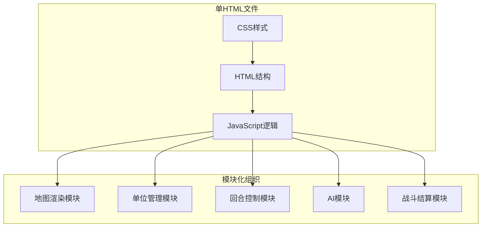

## 1. 架构设计



## 2. 技术描述

- **前端技术**：纯HTML5 + CSS3 + 原生JavaScript (ES6+)
- **渲染引擎**：HTML5 Canvas 2D API
- **构建方式**：无构建工具，所有代码内联在单个HTML文件中
- **外部依赖**：无任何外部库，纯原生实现

## 3. 模块划分

### 3.1 地图渲染模块 (MapRenderer)
- 六边形坐标系统转换（像素坐标 ↔ 网格索引）
- 六边形网格绘制
- 地形颜色渲染
- 可移动/攻击范围高亮
- 单位绘制

### 3.2 单位管理模块 (UnitManager)
- 单位数据结构定义（IUnit接口）
- 单位创建与初始化
- 单位位置管理
- 单位状态更新（HP、已行动标记等）
- 单位朝向管理

### 3.3 回合控制模块 (TurnController)
- 回合状态管理（玩家回合/AI回合）
- 单位行动流程控制
- 胜利条件检测
- 游戏状态锁定/解锁

### 3.4 AI模块 (AIController)
- BFS寻路算法实现
- 敌方单位行动决策
- 目标选择策略（优先低血量）
- 逐个单位行动的延迟执行

### 3.5 战斗结算模块 (BattleSystem)
- 地形防御修正计算
- 朝向加成计算（侧翼/背面攻击）
- 骑兵冲锋技能判定
- 伤害计算公式
- 战斗日志记录
- 浮动伤害数字显示

## 4. 核心数据结构

### 4.1 配置对象 (CONFIG)
```javascript
const CONFIG = {
  MAP: { COLS: 6, ROWS: 9, HEX_SIZE: 40 },
  TERRAIN: {
    PLAIN: { moveCost: 1, defense: 0, color: '#90EE90' },
    FOREST: { moveCost: 2, defense: 2, color: '#228B22' },
    MOUNTAIN: { moveCost: 3, defense: 3, color: '#8B4513' },
    WATER: { moveCost: Infinity, defense: 0, color: '#4169E1' }
  },
  UNITS: {
    INFANTRY: { hp: 100, atk: 20, move: 3, range: 1, name: '步兵' },
    CAVALRY: { hp: 80, atk: 25, move: 5, range: 1, name: '骑兵', chargeBonus: 0.3 },
    ARCHER: { hp: 60, atk: 15, move: 2, range: 3, name: '弓兵' }
  },
  COMBAT: {
    flankBonus: 0.15,
    backBonus: 0.3,
    chargeThreshold: 0.5
  }
};
```

### 4.2 单位接口 (IUnit)
```javascript
interface IUnit {
  id: string;
  type: 'infantry' | 'cavalry' | 'archer';
  faction: 'player' | 'enemy';
  hp: number;
  maxHp: number;
  atk: number;
  move: number;
  range: number;
  x: number;
  y: number;
  facing: number; // 0-5 六个方向
  hasMoved: boolean;
  hasAttacked: boolean;
  moveDistanceThisTurn: number;
}
```

## 5. 六边形坐标系统

采用偏移坐标系统（Offset Coordinates），偶数行偏移：
- 像素坐标转六边形：通过距离计算找到最近六边形中心
- 六边形邻居计算：考虑奇偶行的不同偏移模式
- 六个方向定义：右上、右、右下、左下、左、左上

## 6. 关键算法

### 6.1 BFS寻路算法
- 输入：起始位置、移动力、地形消耗
- 输出：所有可达位置及路径
- 考虑地形移动成本和敌方单位阻挡

### 6.2 朝向判定
- 根据攻击者和防御者位置计算相对方向
- 侧面攻击：15%伤害加成
- 背面攻击：30%伤害加成

### 6.3 AI决策流程
1. 对每个敌方单位，找到范围内所有玩家单位
2. 按优先级排序（低血量 > 近距离 > 可击杀）
3. 使用BFS找到最佳攻击位置
4. 执行移动→攻击序列

## 7. 游戏状态管理

使用单一状态对象管理全局游戏状态：
```javascript
const gameState = {
  phase: 'player_move' | 'player_attack' | 'ai_turn' | 'game_over',
  currentTurn: 'player' | 'enemy',
  selectedUnit: IUnit | null,
  units: IUnit[],
  map: number[][],
  moveableHexes: Set<string>,
  attackableHexes: Set<string>,
  battleLog: string[],
  winner: 'player' | 'enemy' | null
};
```
