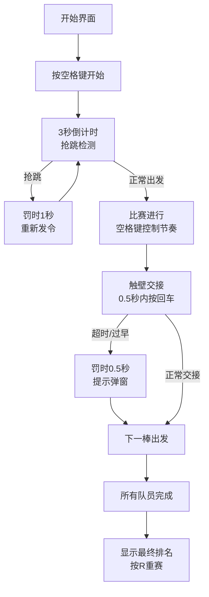

## 1. 产品概述
4x100米混合泳接力竞技游戏，玩家通过空格键节奏控制划水频率，回车键完成交接棒，与3支AI队伍在8泳道游泳馆进行比赛，提供紧张刺激的沉浸式体验。
- 核心玩法：节奏按键控制游泳速度，策略管理体力消耗，精准完成交接棒
- 目标价值：打造单文件可运行的高品质体育游戏，兼具竞技性和娱乐性

## 2. 核心功能

### 2.1 功能模块
1. **比赛主界面**：Canvas渲染泳道、运动员、水纹效果，实时显示排名、时间、体力
2. **控制系统**：空格键控制划水节奏，回车键完成交接棒，实时反馈"perfect/good/bad"
3. **AI系统**：3支AI队伍在最佳频率附近随机游走，成绩差异化随机波动
4. **比赛流程**：倒计时开始、抢跳检测、接力交接、罚时机制、赛后成绩展示

### 2.2 页面详情
| 页面名称 | 模块名称 | 功能描述 |
|---------|---------|----------|
| 比赛页面 | 开始界面 | 按空格键开始，3秒倒计时，抢跳检测 |
| 比赛页面 | 比赛进行 | 实时渲染泳道、运动员、水纹、体力条、排名、计时器 |
| 比赛页面 | 节奏反馈 | 划水频率指示器，"perfect/good/bad"文字反馈 |
| 比赛页面 | 交接棒系统 | 0.5秒窗口内按回车，罚时提示弹窗 |
| 比赛页面 | 赛后结算 | 最终排名、成绩单（精确到0.01秒）、按R重赛 |

## 3. 核心流程
玩家按空格键开始 → 3秒倒计时（抢跳检测）→ 比赛开始 → 空格键控制划水节奏（频率反馈）→ 管理体力消耗 → 触壁时0.5秒内按回车交接棒 → 4棒完成后比赛结束 → 显示最终排名和成绩 → 按R重新比赛

## 4. 用户界面设计

### 4.1 设计风格
- **主色调**：深蓝色系（泳池主题），#1a5f7a 作为主色，#00d4ff 水波纹高光
- **辅助色**：4支队伍分别使用 #ff6b6b、#4ecdc4、#ffe66d、#ff9ff3 区分
- **字体**：使用系统无衬线字体，数字使用等宽字体确保计时对齐
- **视觉效果**：水纹动画、水花粒子、触壁震动、观众音效
- **布局**：Canvas占据全屏，UI元素叠加在画布上方

### 4.2 页面设计概述
| 页面名称 | 模块名称 | UI元素 |
|---------|---------|--------|
| 比赛页面 | 泳道渲染 | 4条泳道，水波纹动画，起点/终点线标记 |
| 比赛页面 | 运动员 | 不同颜色矩形/简笔画，游泳姿态微动 |
| 比赛页面 | HUD界面 | 左上角排名列表，右上角计时器，下方体力条 |
| 比赛页面 | 节奏反馈 | 底部中央频率指示器，彩色"perfect/good/bad"文字 |
| 比赛页面 | 罚时提示 | 屏幕中央红色惩罚文字，1秒后消失 |
| 比赛页面 | 赛后结算 | 中央半透明面板，排名表格，重赛提示 |

### 4.3 响应式
- 桌面端优先，Canvas自适应窗口大小
- 保持游戏区域16:9比例，上下留空填充背景
- 文字大小随Canvas缩放调整

### 4.4 氛围营造
- Web Audio API实现简单观众音效和划水声
- Canvas粒子系统模拟水花效果
- 触壁时轻微屏幕震动效果
- 倒计时和交接棒的视觉强调
