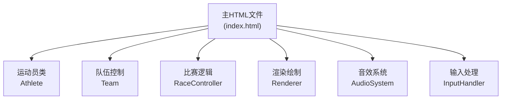

## 1. 架构设计



## 2. 技术描述
- **前端技术**：纯HTML5 + Canvas + JavaScript（ES6+），单文件结构，无第三方依赖
- **渲染引擎**：Canvas 2D API，requestAnimationFrame 驱动主循环，目标60fps
- **计时精度**：performance.now() 实现毫秒级计时，显示精确到0.01秒
- **音频系统**：Web Audio API 生成简单音效（划水声、观众欢呼）
- **AI算法**：随机游走模型，在最佳频率附近波动

## 3. 模块设计

### 3.1 运动员类 (Athlete)
```javascript
class Athlete {
  // 只读属性
  get stamina() { return this._stamina; }
  get speed() { return this._speed; }
  get position() { return this._position; }
  get strokeRate() { return this._strokeRate; }
  get isFinished() { return this._isFinished; }
  
  // 方法
  update(deltaTime, strokeRate) { }
  resetStamina() { }
}
```
- 体力系统：100点上限，低于20点减速，归零后速度减半
- 速度计算：基于划水频率与最佳频率的偏差
- 位置计算：速度 × 时间增量

### 3.2 队伍类 (Team)
```javascript
class Team {
  // 属性
  get id() { return this._id; }
  get name() { return this._name; }
  get color() { return this._color; }
  get currentSwimmer() { return this._swimmers[this._currentSwimmerIndex]; }
  get totalTime() { return this._totalTime; }
  get penalty() { return this._penalty; }
  get isPlayer() { return this._isPlayer; }
  get rank() { return this._rank; }
  
  // 方法
  update(deltaTime) { }
  startRace() { }
  changeSwimmer() { }
  addPenalty(time) { }
  checkTouchWall() { }
}
```
- 4名运动员管理
- 交接棒逻辑
- 罚时累计
- AI划水频率控制（随机游走）

### 3.3 比赛控制器 (RaceController)
```javascript
class RaceController {
  // 状态
  get state() { return this._state; } // idle, countdown, racing, finished
  get countdown() { return this._countdown; }
  get raceTime() { return this._raceTime; }
  
  // 方法
  init() { }
  startCountdown() { }
  startRace() { }
  update(deltaTime) { }
  handleKeyPress(key) { }
  calculateRanks() { }
  reset() { }
}
```
- 状态管理：空闲 → 倒计时 → 比赛中 → 结束
- 抢跳检测
- 全局计时
- 排名计算

### 3.4 渲染器 (Renderer)
```javascript
class Renderer {
  constructor(canvas) { }
  render(raceController, teams) { }
  renderPool() { }
  renderSwimmers(teams) { }
  renderHUD(raceController, teams) { }
  renderRhythmIndicator(strokeRate) { }
  renderPenaltyMessage(message) { }
  renderResults(teams) { }
  addWaterParticles(x, y) { }
  shakeScreen(intensity) { }
}
```
- 泳池背景和水纹动画
- 运动员渲染
- HUD界面（排名、时间、体力条）
- 节奏指示和反馈文字
- 罚时弹窗
- 赛后成绩展示
- 粒子效果和屏幕震动

### 3.5 输入处理器 (InputHandler)
```javascript
class InputHandler {
  onKeyPress(callback) { }
  onSpacePress(callback) { }
  onEnterPress(callback) { }
  getStrokeRate() { }
  resetStrokeRate() { }
}
```
- 空格键按压频率计算（最近5次间隔平均）
- 回车键交接棒检测
- 事件回调机制

### 3.6 音效系统 (AudioSystem)
```javascript
class AudioSystem {
  constructor() { }
  init() { }
  playStrokeSound() { }
  playStartSound() { }
  playCheerSound() { }
  playPenaltySound() { }
}
```
- 使用 Web Audio API 生成音效
- 划水声（低频脉冲）
- 开始信号（高音哔声）
- 观众欢呼（白噪声滤波）
- 罚时音效（低沉嗡声）

## 4. 核心参数

| 参数 | 值 | 说明 |
|------|----|------|
| POOL_LENGTH | 800px | 泳池长度（像素） |
| LANE_COUNT | 4 | 使用泳道数 |
| BEST_STROKE_RATE | 60次/分钟 | 最佳划水频率 |
| STROKE_RATE_TOLERANCE | ±10次/分钟 | Perfect区间 |
| MAX_STAMINA | 100 | 最大体力值 |
| LOW_STAMINA_THRESHOLD | 20 | 低体力阈值 |
| CHANGE_WINDOW | 0.5秒 | 交接棒时间窗口 |
| COUNTDOWN_TIME | 3秒 | 倒计时时长 |
| FALSE_START_PENALTY | 1秒 | 抢跳罚时 |
| BAD_CHANGE_PENALTY | 0.5秒 | 交接棒失误罚时 |
