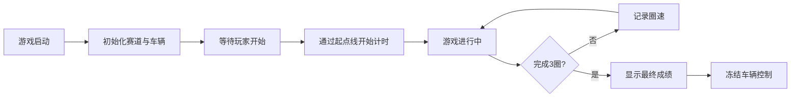

## 1. 产品概述

本项目是一个基于HTML5 Canvas的2D赛车竞速游戏前端原型，采用模块化设计，所有代码整合在单个HTML文件中，可直接在浏览器中运行。
- 主要目的：提供一个功能完整、体验流畅的单人竞速游戏，包含真实物理模拟、AI对手、漂移系统等核心玩法
- 目标用户：休闲游戏玩家、赛车游戏爱好者、前端技术学习者

## 2. 核心功能

### 2.1 功能模块
1. **赛道系统**：封闭式赛道绘制、碰撞检测、驶出赛道惩罚机制
2. **车辆操控**：键盘控制、物理模拟（惯性、打滑、重量转移）
3. **氮气系统**：漂移积累氮气、激活加速、UI进度条显示
4. **计时系统**：三圈制、圈速记录、最佳圈速、HUD显示
5. **AI对手**：3辆AI车辆、路径跟随、避障逻辑、圈速控制
6. **漂移系统**：手刹漂移、烟雾粒子效果、积分计算
7. **动态天气**：晴天/雨天随机切换、操控影响
8. **音效系统**：Web Audio API生成实时音效
9. **性能监控**：FPS显示、帧率警告

### 2.2 页面详情
| 页面名称 | 模块名称 | 功能描述 |
|---------|---------|---------|
| 游戏主界面 | 赛道渲染 | Canvas绘制封闭式赛道，包含弯道和直道 |
| 游戏主界面 | 车辆渲染 | 玩家车辆和3辆AI车辆的2D顶视角渲染 |
| 游戏主界面 | HUD显示 | 圈速、氮气条、积分、FPS、逆向警告等信息显示 |
| 游戏主界面 | 粒子效果 | 漂移烟雾、轮胎痕迹等动态效果 |

## 3. 核心流程

## 4. 用户界面设计

### 4.1 设计风格
- **主色调**：深灰色(#1a1a2e)背景，赛道采用沥青深灰色(#2d2d44)，赛道边缘白色标线
- **强调色**：玩家车辆红色(#e94560)，AI车辆分别为蓝色(#0f3460)、绿色(#53d397)、黄色(#ffd93d)
- **UI风格**：赛博朋克风格，半透明黑色HUD面板，霓虹色文字
- **字体**：使用等宽字体(Consolas, Monaco)显示计时数据，增强科技感

### 4.2 页面设计概述
| 页面名称 | 模块名称 | UI元素 |
|---------|---------|--------|
| 游戏主界面 | 赛道区域 | 全屏Canvas，深灰色沥青赛道，白色边界线，黄色起点/终点线 |
| 游戏主界面 | HUD左上角 | 圈数、当前圈时间、上一圈时间、最佳圈时间 |
| 游戏主界面 | HUD右上角 | FPS显示、天气状态 |
| 游戏主界面 | HUD左下角 | 氮气进度条、漂移积分 |
| 游戏主界面 | 警告提示 | 逆向行驶时屏幕中央显示红色警告文字 |

### 4.3 响应式
- 采用固定Canvas尺寸(1200x800)，居中显示
- HUD元素使用相对定位，适配不同屏幕尺寸
