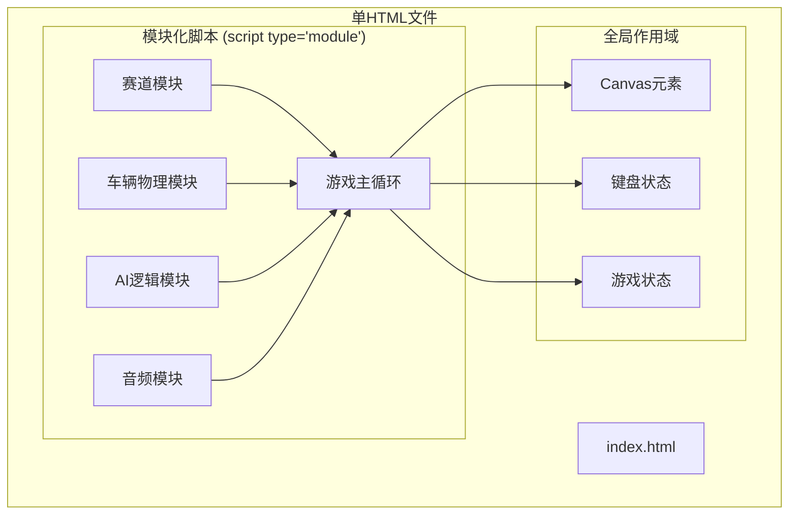

## 1. 架构设计



## 2. 技术描述
- **前端技术**：纯HTML5 + JavaScript (ES6 Modules) + 2D Canvas
- **无外部依赖**：不使用任何第三方库，所有功能原生实现
- **音频引擎**：Web Audio API实时合成音效
- **物理引擎**：自定义2D车辆物理模拟

## 3. 模块定义

| 模块名称 | 职责 | 导出接口 |
|---------|------|---------|
| 赛道模块 | 赛道数据定义、碰撞检测、路径点计算 | `createTrack()`, `drawTrack()`, `checkCollision()`, `getTrackPoint()`, `checkLap()`, `isReverseDirection()` |
| 车辆物理模块 | 车辆物理模拟、操控逻辑、漂移系统 | `createCar()`, `updateCar()`, `drawCar()`, `applyNitro()`, `isDrifting()`, `getNitroLevel()` |
| AI逻辑模块 | AI车辆行为、路径跟随、避障 | `createAICar()`, `updateAI()`, `setPlayerSpeed()` |
| 音频模块 | Web Audio API音效生成 | `initAudio()`, `playEngineSound()`, `playCollisionSound()`, `playNitroSound()`, `stopAllSounds()` |
| 主游戏模块 | 游戏循环、HUD渲染、输入处理、状态管理 | `initGame()`, `gameLoop()`, `updateHUD()`, `handleInput()` |

## 4. 核心数据结构

### 4.1 赛道数据结构
```javascript
{
  width: Number,
  height: Number,
  trackPoints: Array<{x, y, angle}>,
  trackWidth: Number,
  boundaryPolygon: Array<{x, y}>
}
```

### 4.2 车辆数据结构
```javascript
{
  x: Number,
  y: Number,
  angle: Number,
  speed: Number,
  maxSpeed: Number,
  acceleration: Number,
  turnSpeed: Number,
  driftAngle: Number,
  nitro: Number,
  isPlayer: Boolean,
  color: String,
  weightTransfer: Number,
  offTrack: Boolean,
  lap: Number,
  lapTime: Number,
  bestLap: Number
}
```

### 4.3 游戏状态结构
```javascript
{
  running: Boolean,
  paused: Boolean,
  currentLap: Number,
  totalLaps: 3,
  currentTime: Number,
  lastLapTime: Number,
  bestLapTime: Number,
  weather: 'sunny' | 'rainy',
  weatherTimer: Number,
  score: Number,
  fps: Number,
  isReverse: Boolean
}
```

## 5. 性能优化策略

1. **Canvas渲染优化**：使用离屏Canvas缓存赛道背景
2. **粒子系统优化**：限制粒子数量上限(≤50个)，使用对象池
3. **碰撞检测优化**：空间分区，仅检测附近区域
4. **帧率控制**：使用requestAnimationFrame，目标60fps
5. **内存管理**：重用对象，避免频繁GC
