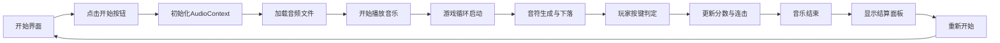

## 1. 产品概述

一款基于Canvas和Web Audio API的下落式4轨音乐节奏游戏，玩家在音符与判定线重合时按下对应按键获得分数，提供流畅的打击反馈和丰富的结算展示。

- 核心玩法：4键下落式音符，支持Perfect/Great/Miss判定
- 目标用户：音乐游戏爱好者、休闲玩家
- 产品价值：轻量级、可直接浏览器运行的节奏游戏原型

## 2. 核心功能

### 2.1 功能模块
1. **游戏主界面**：Canvas渲染的4轨下落音符、判定线、分数、连击、进度条
2. **音频模块**：Web Audio API实现音频加载、播放、时间同步
3. **判定系统**：按键时间差判定、分数计算、连击统计
4. **渲染系统**：音符、特效、UI元素的Canvas绘制
5. **结算面板**：游戏结束后的成绩展示和评级

### 2.2 页面详情
| 页面名称 | 模块名称 | 功能描述 |
|----------|----------|----------|
| 开始界面 | 开始遮罩层 | 点击按钮初始化AudioContext并开始游戏 |
| 游戏界面 | 游戏主画面 | 4轨音符下落、按键判定、实时分数显示 |
| 结算界面 | 结果面板 | 展示总分、连击数、各判定数量、评级、全完美标识 |

## 3. 核心流程

用户点击开始按钮 → 初始化音频上下文 → 加载并播放音乐 → 游戏循环开始 → 音符按节拍生成下落 → 玩家按键触发判定 → 音乐播放结束 → 显示结算面板 → 可重新开始游戏

## 4. 用户界面设计

### 4.1 设计风格
- **主色调**：深色背景（#0a0a1a）配合霓虹蓝（#00d4ff）和霓虹粉（#ff00aa）
- **辅助色**：Perfect判定金色（#ffd700）、Great判定青色（#00ffaa）
- **字体**：使用现代无衬线字体，数字使用等宽字体
- **视觉风格**：赛博朋克风，霓虹发光效果，深色科技感

### 4.2 页面设计概述
| 页面名称 | 模块名称 | UI元素 |
|----------|----------|--------|
| 游戏界面 | 轨道区域 | 4条垂直轨道、判定线发光效果、按键高亮反馈 |
| 游戏界面 | 信息区域 | 左上角分数、右上角连击数、底部进度条 |
| 结算界面 | 结果面板 | 居中半透明面板、各项统计数据、评级徽章、重新开始按钮 |

### 4.3 响应式
- 基于800x600设计分辨率，Canvas自动等比例缩放
- 支持窗口大小变化时自动居中显示
- 游戏元素坐标使用相对计算，确保画面完整

### 4.4 动画效果
- 音符击中时的粒子爆炸特效
- 判定文字的弹出和淡出
- 连击达到10倍数时的高亮脉冲
- 结算面板的滑入和渐显动画
- 错失音符的淡化消散效果
