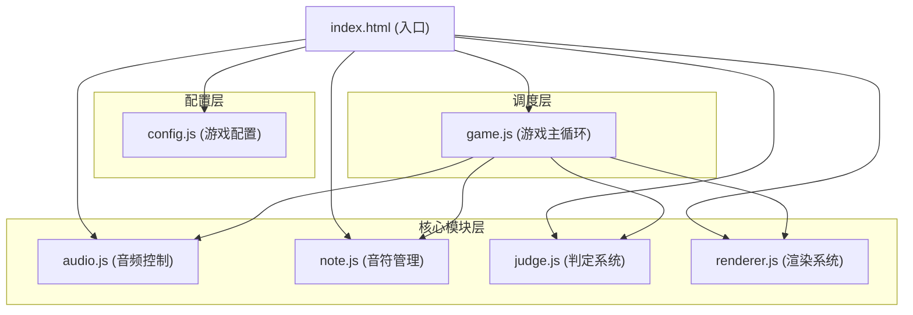

## 1. 架构设计



## 2. 技术描述

- **前端技术栈**：原生HTML5 + JavaScript + CSS3
- **渲染引擎**：Canvas 2D API，60fps刷新率
- **音频处理**：Web Audio API
- **模块组织**：IIFE模式，全局命名空间RhythmGame
- **无依赖库**：纯原生实现，无需安装任何npm包

## 3. 文件结构

| 文件路径 | 功能描述 |
|----------|----------|
| /index.html | 入口文件，加载所有JS模块和CSS |
| /styles.css | 全局样式，包含遮罩层和按钮样式 |
| /js/config.js | 游戏配置：判定窗口、下落速度、BPM、颜色等 |
| /js/audio.js | 音频加载、播放控制、时间获取、节拍回调 |
| /js/note.js | 音符对象定义、生成、状态管理 |
| /js/judge.js | 按键事件处理、音符匹配、判定逻辑、分数计算 |
| /js/renderer.js | Canvas绘制封装：轨道、音符、特效、UI |
| /js/game.js | 游戏主循环、状态管理、模块协同调度 |

## 4. 模块接口定义

### 4.1 全局命名空间
```javascript
window.RhythmGame = {
  config: {},
  audio: {},
  note: {},
  judge: {},
  renderer: {},
  game: {}
};
```

### 4.2 Audio模块接口
- `init()`: 初始化AudioContext
- `loadAudio(url)`: 加载音频文件
- `play()`: 开始播放
- `pause()`: 暂停播放
- `getCurrentTime()`: 获取当前播放时间(秒)
- `getDuration()`: 获取音频总时长
- `onBeat(callback)`: 注册节拍回调

### 4.3 Note模块接口
- `createNote(track, time)`: 创建音符
- `updateNotes(currentTime)`: 更新所有音符状态
- `getActiveNotes(track)`: 获取指定轨道的活动音符
- `hitNote(note)`: 标记音符击中
- `missNote(note)`: 标记音符错过
- `clearAll()`: 清除所有音符

### 4.4 Judge模块接口
- `handleKeyPress(track)`: 处理按键事件
- `calculateScore(judgement)`: 计算分数
- `getCombo()`: 获取当前连击
- `getMaxCombo()`: 获取最大连击
- `getStats()`: 获取判定统计(Perfect/Great/Miss)

### 4.5 Renderer模块接口
- `init(canvas)`: 初始化渲染器
- `resize()`: 处理窗口大小变化
- `render()`: 渲染一帧画面
- `showJudgement(text, color, x, y)`: 显示判定文字
- `showEffect(x, y, type)`: 显示击中特效

### 4.6 Game模块接口
- `init()`: 初始化游戏
- `start()`: 开始游戏
- `restart()`: 重新开始
- `gameLoop()`: 主循环
- `showResult()`: 显示结算面板

## 5. 核心算法

### 5.1 音符位置计算
```
音符Y坐标 = 判定线Y - (音符目标时间 - 当前时间) * 下落速度
```

### 5.2 判定时间窗口
- Perfect: ±40ms
- Great: ±80ms
- Miss: 超出范围或未击中

### 5.3 分数计算
- Perfect: 100分 × 连击系数
- Great: 50分 × 连击系数
- 连击系数 = 1 + combo / 100 (最大2.0)

## 6. 可配置项

| 配置项 | 默认值 | 说明 |
|--------|--------|------|
| CANVAS_WIDTH | 800 | 画布宽度 |
| CANVAS_HEIGHT | 600 | 画布高度 |
| NOTE_SPEED | 400 | 音符下落速度(像素/秒) |
| PERFECT_WINDOW | 40 | Perfect判定窗口(ms) |
| GREAT_WINDOW | 80 | Great判定窗口(ms) |
| BPM | 120 | 歌曲BPM |
| TRACK_COUNT | 4 | 轨道数量 |
| KEYS | ['D','F','J','K'] | 对应按键 |
