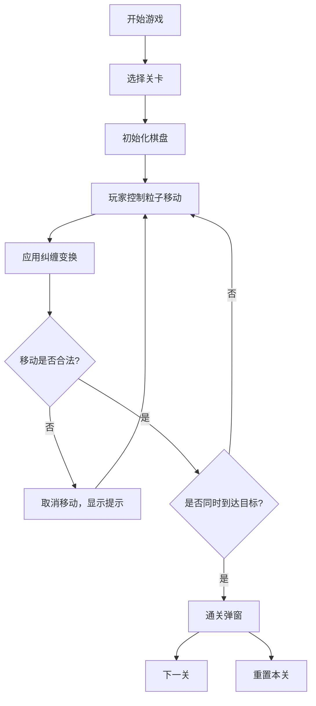

## 1. 产品概述
量子纠缠解谜游戏是一款基于量子纠缠概念的益智解谜游戏，玩家需要通过控制一个粒子，利用纠缠变换规则让两个粒子同时到达各自的目标位置。
- 主要目的：提供有趣的解谜体验，同时科普量子纠缠概念
- 目标用户：所有年龄段的益智游戏爱好者
- 产品价值：创新的游戏机制，兼具娱乐性和教育性

## 2. 核心功能

### 2.1 功能模块
1. **游戏主界面**：Canvas棋盘、粒子、障碍物、目标位置
2. **关卡选择**：5个预设关卡，支持不同网格尺寸
3. **控制系统**：键盘方向键 + 移动端触摸滑动
4. **游戏状态**：步数计数、撤销功能、通关判定

### 2.2 页面详情
| 页面名称 | 模块名称 | 功能描述 |
|-----------|-------------|---------------------|
| 游戏主界面 | 棋盘渲染 | N×N网格，障碍物、粒子、目标位置绘制 |
| 游戏主界面 | 控制面板 | 关卡选择、步数显示、撤销按钮、重置按钮 |
| 游戏主界面 | 通关弹窗 | 显示步数、下一关、重置本关 |

## 3. 核心流程
用户选择关卡 → 控制粒子移动 → 另一个粒子按纠缠规则自动移动 → 校验移动合法性 → 两个粒子同时到达目标 → 通关 → 进入下一关

## 4. 用户界面设计

### 4.1 设计风格
- **主色调**：深蓝科技感主题 (#0a1628)
- **粒子颜色**：蓝色 (#00d4ff) 和红色 (#ff4757)
- **按钮风格**：圆角渐变按钮，带有微光效果
- **字体**：使用现代无衬线字体，科技感强
- **布局风格**：居中棋盘，顶部控制面板
- **视觉效果**：粒子发光效果、半完成状态脉冲动画

### 4.2 页面设计概述
| 页面名称 | 模块名称 | UI元素 |
|-----------|-------------|-------------|
| 游戏主界面 | 棋盘 | 居中Canvas，网格线，障碍物深色块，目标位置半透明圈 |
| 游戏主界面 | 粒子 | 圆形，发光效果，蓝色和红色区分 |
| 游戏主界面 | 控制面板 | 顶部水平排列，关卡选择下拉、步数、按钮 |
| 游戏主界面 | 弹窗 | 半透明背景，居中白色卡片 |

### 4.3 响应式
- 桌面端优先，移动端自适应
- Canvas画布等比例缩放，保持居中
- 移动端禁止页面缩放
- 触摸滑动识别方向，支持全屏操作

### 4.4 视觉动效
- 粒子移动平滑过渡动画
- 碰撞时的抖动反馈
- 半完成状态的脉冲发光
- 通关时的粒子爆炸效果
- 按钮悬停和点击反馈
