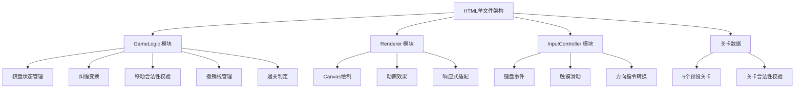

## 1. 架构设计



## 2. 技术描述
- **前端技术：纯HTML + CSS + JavaScript（单文件）
- **渲染引擎**：HTML5 Canvas 2D
- **模块化方式**：使用IIFE和类实现模块化
- **无外部依赖**：所有代码内联在单个HTML文件中

## 3. 模块接口定义

### 3.1 GameLogic 模块
```javascript
class GameLogic {
  constructor(levelData, entanglementTransform)
  loadLevel(levelData)
  moveParticle(direction)
  undo()
  validateLevelData(levelData)
  checkWin()
  getState()
}
```

### 3.2 Renderer 模块
```javascript
class Renderer {
  constructor(canvas, gameLogic)
  resize()
  render()
  showCollisionEffect()
  showWinEffect()
  showHalfCompleteEffect()
}
```

### 3.3 InputController 模块
```javascript
class InputController {
  constructor(gameLogic, renderer)
  initKeyboard()
  initTouch()
  onMove(callback)
}
```

### 3.4 纠缠变换接口
```javascript
// 可替换的纠缠变换函数
type EntanglementTransform = (pos, gridSize) => newPos
```

## 4. 数据结构

### 4.1 关卡数据结构
```javascript
{
  id: number,
  name: string,
  gridSize: number,
  obstacles: [[x, y],
  particles: {
    blue: [x, y],
    red: [x, y]
  },
  targets: {
    blue: [x, y],
    red: [x, y]
  }
}
```

### 4.2 游戏状态
```javascript
{
  gridSize: number,
  particles: { blue: [x, y], red: [x, y] },
  obstacles: [[x, y]],
  targets: { blue: [x, y], red: [x, y] },
  steps: number,
  undoStack: [state]
}
```

## 5. 关卡配置
| 关卡ID | 网格尺寸 | 特点 |
|---------|---------|------|
| 1 | 4×4 | 入门教程关，简单布局 |
| 2 | 5×5 | 中等难度，增加障碍 |
| 3 | 5×5 | 复杂布局 |
| 4 | 6×6 | 大棋盘，复杂路径 |
| 5 | 6×6 | 高难度挑战 |

## 6. 性能要求
- Canvas重绘在resize后300ms内完成
- 帧率保持30fps以上
- 撤销栈深度至少10步
- 触摸滑动识别准确率接近100%

## 7. 浏览器兼容性
- Chrome 90+
- Safari 15+
- Firefox 90+
- 对应移动版浏览器
