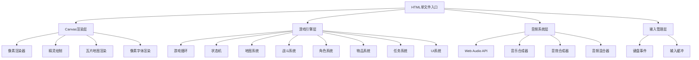

## 1. 架构设计



## 2. 技术栈说明

- **渲染**：HTML5 Canvas 2D Context
- **音频**：Web Audio API（完全程序化合成，无外部音频文件）
- **语言**：原生 JavaScript (ES2020)
- **打包**：单HTML文件内联所有JS/CSS
- **分辨率**：逻辑480x320，CSS整数倍缩放

## 3. 核心数据结构

### 3.1 角色数据

```javascript
interface Character {
  name: string;
  level: number;
  hp: number;
  maxHp: number;
  attack: number;
  defense: number;
  speed: number;
  exp: number;
  expToNext: number;
  gold: number;
  x: number;
  y: number;
  direction: 'up'|'down'|'left'|'right';
}
```

### 3.2 敌人数据

```javascript
interface Enemy {
  id: string;
  name: string;
  hp: number;
  maxHp: number;
  attack: number;
  defense: number;
  speed: number;
  expReward: number;
  goldReward: number;
  aiType: 'healer'|'charger'|'coward'|'boss';
  sprite: PixelSprite;
}
```

### 3.3 物品数据

```javascript
interface Item {
  id: string;
  name: string;
  type: 'consumable'|'scroll';
  effect: {
    stat?: 'hp'|'attack'|'defense'|'speed';
    value: number;
  };
  description: string;
  icon: number[][];
}
```

### 3.4 地图数据

```javascript
interface GameMap {
  id: string;
  name: string;
  width: number;
  height: number;
  tiles: number[][];
  enemies: {x: number, y: number, enemyId: string}[];
  npcs: {x: number, y: number, dialog: string}[];
  exits: {x: number, y: number, targetMap: string, targetX: number, targetY: number}[];
}
```

### 3.5 战斗状态

```javascript
interface BattleState {
  phase: 'start'|'playerTurn'|'enemyTurn'|'victory'|'defeat';
  turnCount: number;
  totalDamage: number;
  player: Character;
  enemies: Enemy[];
  selectedCommand: 'attack'|'skill'|'item'|'flee';
  battleLog: string[];
}
```

## 4. 核心系统设计

### 4.1 游戏循环

```javascript
class GameLoop {
  lastTime: number;
  accumulator: number;
  fixedTimeStep: number = 1000/60;
  
  update(deltaTime: number) { /* 逻辑更新 */ }
  render() { /* 画面渲染 */ }
  
  start() {
    requestAnimationFrame(this.loop.bind(this));
  }
  
  loop(currentTime: number) {
    const deltaTime = currentTime - this.lastTime;
    this.lastTime = currentTime;
    this.accumulator += deltaTime;
    
    while (this.accumulator >= this.fixedTimeStep) {
      this.update(this.fixedTimeStep);
      this.accumulator -= this.fixedTimeStep;
    }
    
    this.render();
    requestAnimationFrame(this.loop.bind(this));
  }
}
```

### 4.2 像素字体系统

使用内嵌的8x8像素字模数据，通过Canvas像素操作绘制文字。

```javascript
const FONT_DATA = {
  'A': [0x3E,0x51,0x51,0x7F,0x51,0x51,0x51,0x00],
  'B': [0x7E,0x49,0x49,0x7E,0x49,0x49,0x7E,0x00],
  // ... 完整ASCII字模
};

function drawPixelText(ctx, text, x, y, color) {
  for (let i = 0; i < text.length; i++) {
    const charData = FONT_DATA[text[i]] || FONT_DATA['?'];
    for (let row = 0; row < 8; row++) {
      for (let col = 0; col < 8; col++) {
        if (charData[row] & (1 << (7 - col))) {
          ctx.fillStyle = color;
          ctx.fillRect(x + i*8 + col, y + row, 1, 1);
        }
      }
    }
  }
}
```

### 4.3 Web Audio 音乐合成

使用振荡器和增益节点合成管弦乐音色：

```javascript
class AudioSystem {
  ctx: AudioContext;
  masterGain: GainNode;
  bgmGain: GainNode;
  sfxGain: GainNode;
  
  playNote(freq, duration, type, gain) {
    const osc = this.ctx.createOscillator();
    const g = this.ctx.createGain();
    osc.type = type;
    osc.frequency.value = freq;
    g.gain.setValueAtTime(0, this.ctx.currentTime);
    g.gain.linearRampToValueAtTime(gain, this.ctx.currentTime + 0.01);
    g.gain.linearRampToValueAtTime(0, this.ctx.currentTime + duration);
    osc.connect(g).connect(this.masterGain);
    osc.start();
    osc.stop(this.ctx.currentTime + duration);
  }
  
  startBGM(isBattle: boolean) {
    // 弦乐层：正弦波，主旋律
    // 铜管层：锯齿波，和声
    // 打击乐层：噪声，节奏
  }
}
```

### 4.4 瓦片碰撞检测

```javascript
function checkCollision(map, x, y) {
  const tile = map.tiles[Math.floor(y/16)][Math.floor(x/16)];
  return tile === TILE_TYPES.WALL || tile === TILE_TYPES.OBSTACLE;
}
```

### 4.5 敌人AI行为

```javascript
function enemyTurn(enemy, player) {
  switch(enemy.aiType) {
    case 'healer':
      if (enemy.hp < enemy.maxHp * 0.5 && Math.random() < 0.7) {
        return { action: 'heal', value: 20 };
      }
      return { action: 'attack' };
    case 'charger':
      if (!enemy.charge) enemy.charge = 0;
      enemy.charge++;
      if (enemy.charge >= 2) {
        enemy.charge = 0;
        return { action: 'critical', multiplier: 2.5 };
      }
      return { action: 'charge' };
    case 'coward':
      if (enemy.hp < enemy.maxHp * 0.3 && Math.random() < 0.5) {
        return { action: 'flee' };
      }
      return { action: 'attack' };
  }
}
```

## 5. 游戏状态机

```
EXPLORE ↔ BATTLE ↔ VICTORY_EVAL
   ↓         ↓
MENU      DEFEAT → RESPAWN
   ↓
INVENTORY / STATUS / QUEST / LOG
```

## 6. 战斗评价算法

```javascript
function evaluateBattle(playerHpPercent, turnCount, totalDamage) {
  let score = 0;
  score += playerHpPercent * 50;           // 50% 权重
  score += Math.max(0, 10 - turnCount) * 3; // 30% 权重
  score += Math.min(totalDamage / 500, 20); // 20% 权重
  
  let grade, stars;
  if (score >= 90) { grade = 'S'; stars = 5; }
  else if (score >= 80) { grade = 'A'; stars = 4; }
  else if (score >= 70) { grade = 'B'; stars = 3; }
  else if (score >= 60) { grade = 'C'; stars = 2; }
  else { grade = 'D'; stars = 1; }
  
  return { score, grade, stars };
}
```
