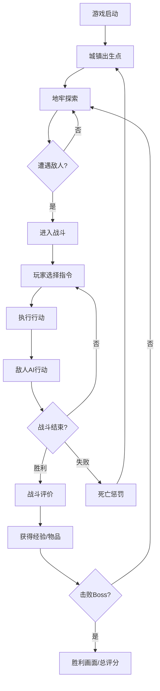

## 1. 产品概述

像素复古风地牢RPG游戏，玩家控制角色探索地牢、与敌人战斗、收集物品、升级成长，最终击败深层Boss完成主线任务。游戏采用单HTML文件Canvas渲染，无需任何依赖即可在浏览器中运行。

- 核心玩法：地牢探索 + 回合制战斗 + 角色成长 + 任务驱动
- 目标用户：复古游戏爱好者、休闲玩家

## 2. 核心特性

### 2.1 功能模块

1. **地牢探索模块**：瓦片地图渲染、网格化移动、碰撞检测、5个功能区域
2. **战斗系统模块**：回合制战斗、指令菜单、战斗动画、敌人AI
3. **角色系统模块**：属性管理、经验升级、死亡重生
4. **物品系统模块**：背包管理、战斗内外物品使用
5. **音频系统模块**：Web Audio合成音乐、音效播放
6. **UI系统模块**：状态面板、对话日志、任务记录、战斗评价
7. **任务系统模块**：主线任务追踪、Boss战、胜利结算

### 2.2 功能详情

| 模块名称 | 功能描述 |
|---------|----------|
| 地牢探索 | 基于瓦片地图的5个区域（城镇、森林、洞穴、地牢入口、Boss房间），网格化移动，障碍物碰撞 |
| 战斗系统 | 明雷触发战斗，玩家和敌人轮流行动，攻击/技能/物品/逃跑指令选择 |
| 角色属性 | HP/攻击/防御/速度/经验值，击败敌人获得经验，升级提升属性并满血 |
| 敌人AI | 3种敌人：治疗型（优先自疗）、蓄力型（积攒能量暴击）、胆小型（残血逃跑）+ Boss |
| 物品系统 | 5种物品：治疗药水、攻击卷轴、防御卷轴、速度药水、全恢复药 |
| 音频系统 | 非战斗BGM和战斗BGM各一套，含弦乐/铜管/打击乐三层；攻击/受伤/技能/物品/胜利音效 |
| 战斗评价 | 剩余HP%、回合数、总伤害计算评分，星级展示 |
| 死亡系统 | 保留经验/物品，扣减金币/经验，重生在城镇 |
| 任务系统 | 主线：找到并击败地牢Boss，任务日志记录状态 |

## 3. 核心流程

## 4. 用户界面设计

### 4.1 设计风格
- **整体风格**：8-bit/16-bit 像素复古风
- **分辨率**：480x320 像素，整数倍放大
- **色盘**：64色限制，NES/GB风格复古色调
- **字体**：内嵌像素字模，8x8像素字符
- **布局**：经典RPG布局，顶部状态栏，中部游戏画面，底部信息/菜单

### 4.2 界面设计

| 界面 | 模块 | UI元素 |
|------|------|--------|
| 探索界面 | 状态面板 | HP条、等级、金币、经验条 |
| 探索界面 | 地图区域 | 瓦片地图、角色精灵、NPC、敌人明雷 |
| 探索界面 | 底部菜单 | 背包、状态、任务、日志 |
| 战斗界面 | 战斗场景 | 背景、玩家/敌人战斗姿态像素画 |
| 战斗界面 | 血条UI | HP条、数值显示、状态效果图标 |
| 战斗界面 | 指令菜单 | 攻击/技能/物品/逃跑 四向选择 |
| 战斗界面 | 战斗日志 | 行动描述、伤害数字滚动 |
| 评价界面 | 评分展示 | 星级/字母等级、详细数据统计 |
| 背包界面 | 物品列表 | 物品图标、名称、数量、使用按钮 |
| 任务界面 | 任务记录 | 任务描述、进度状态、完成标记 |

### 4.3 响应式
- 固定480x320分辨率，居中显示
- 自适应窗口大小，保持像素比例
- 键盘操作优先，支持方向键+Enter/ESC

## 5. 视觉与交互规范

### 5.1 像素绘制规范
- 角色精灵：16x16像素，4方向行走动画
- 战斗姿态：32x32或64x64像素
- 瓦片：16x16像素，地面/墙壁/门/装饰
- 字体：8x8像素字模，不使用系统字体

### 5.2 动画规范
- 角色移动：150ms/格，2帧行走动画
- 战斗动画：攻击抖动、受击闪烁、伤害数字飘字
- 转场效果：淡入淡出、像素溶解
- UI动效：菜单光标闪烁、按钮按下反馈

### 5.3 操作规范
- 方向键/WASD：移动
- Enter/Space：确认、交互
- ESC：取消、打开菜单
- 1-4：战斗快捷指令
