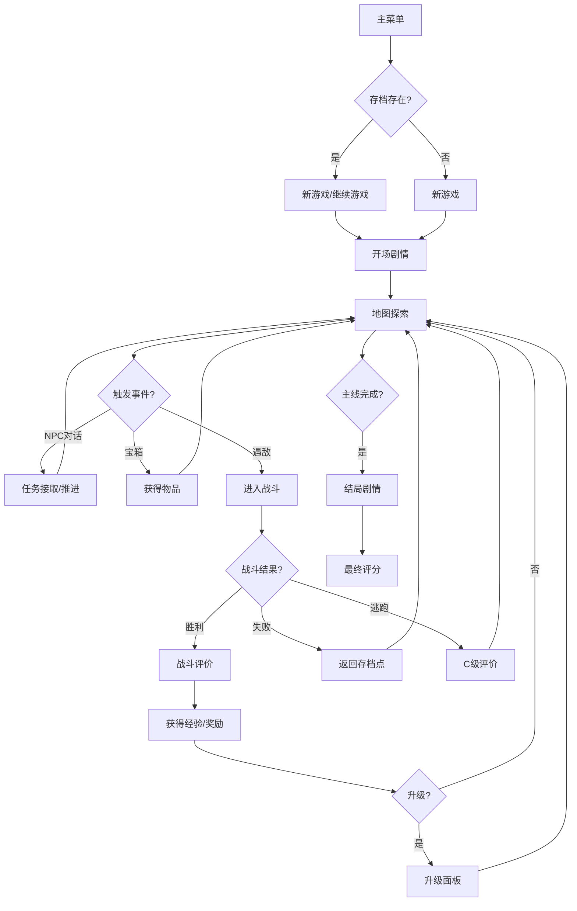

## 1. 产品概述
像素复古仙侠回合制RPG游戏，采用16色像素风格呈现中国古典仙侠世界，融合回合制战斗、地图探索、任务系统和角色成长等核心玩法。
- 目标用户：怀旧游戏爱好者、像素艺术爱好者、回合制RPG玩家
- 产品价值：单文件HTML游戏，无需安装即可体验完整的仙侠冒险旅程

## 2. 核心功能

### 2.1 功能模块
1. **主菜单**：新游戏、继续游戏、存档管理
2. **开场剧情**：像素对话框逐字显示，角色立绘表情变化
3. **地图探索**：俯视角像素地图，三区域可自由探索，NPC/宝箱/遇敌交互
4. **回合制战斗**：攻击/防御/技能/物品/逃跑五行动，敌人AI策略化
5. **任务系统**：1主线+2支线任务，任务日志面板
6. **角色成长**：经验升级、属性成长、技能领悟
7. **战斗评价**：S/A/B/C分级，额外经验奖励
8. **结局剧情**：根据总评分展示不同结局
9. **存档系统**：localStorage本地存档

### 2.2 页面详情
| 页面名称 | 模块名称 | 功能描述 |
|---------|---------|---------|
| 主菜单 | 菜单选择 | 新游戏/继续游戏选项，存档状态检测 |
| 开场剧情 | 剧情对话 | 像素对话框逐字显示，角色立绘表情变化 |
| 地图探索 | 场景渲染 | 三区域像素地图，四方向行走动画 |
| 战斗界面 | 战斗系统 | 回合制行动选择，仙术特效，HP/MP显示 |
| 任务面板 | 任务日志 | 当前任务目标，完成状态显示 |
| 升级界面 | 成长系统 | 属性变化面板，新技能提示 |
| 战斗评价 | 评分系统 | S/A/B/C等级显示，额外奖励 |
| 结局剧情 | 多结局 | 根据总评分展示不同结局倾向 |

## 3. 核心流程

## 4. 用户界面设计

### 4.1 设计风格
- **主色调**：16色像素复古配色，以墨黑、朱砂、石青、金黄为主
- **像素风格**：16位机低分辨率，640x480固定画布，等比缩放
- **字体**：Canvas手动绘制像素字体，无系统字体
- **边框**：中国风回纹边框，云纹装饰
- **整体氛围**：古典仙侠、复古怀旧

### 4.2 页面设计概述
| 页面名称 | 模块名称 | UI元素 |
|---------|---------|---------|
| 主菜单 | 标题界面 | 像素游戏标题、祥云背景、菜单选项光标 |
| 地图探索 | 游戏主界面 | 像素地图、角色精灵、NPC/宝箱标记、迷你地图 |
| 战斗界面 | 战斗场景 | 角色/敌人立绘、血条MP条、行动菜单、技能特效 |
| 对话框 | 剧情系统 | 中国风边框、逐字显示、角色头像、表情变化 |
| 任务面板 | UI界面 | 卷轴式背景、任务列表、进度标记 |
| 评价界面 | 结算窗口 | 星级评价、属性统计、奖励列表 |

### 4.3 响应式
- 桌面端：键盘WASD/方向键控制，鼠标点击交互
- 移动端：触屏虚拟摇杆，四方向触控按钮
- 画布640x480固定分辨率，等比缩放适配窗口

### 4.4 音频设计
- **背景音乐**：中国风民乐，Web Audio API程序化生成
- **场景音乐**：探索（笛子主奏）、战斗（琵琶+鼓点）、胜利（古筝）
- **音阶**：五声音阶（宫商角徵羽）
- **音效**：攻击、防御、技能、获得物品等民乐风格音效
