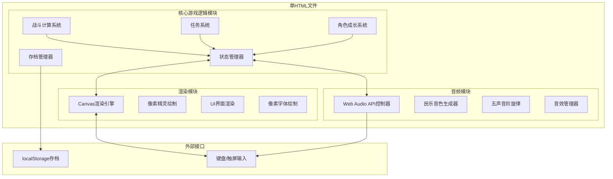

## 1. 架构设计



## 2. 技术描述
- **前端技术**：原生HTML5 + Canvas 2D + JavaScript (ES6+)
- **打包方式**：单HTML文件内联所有CSS/JS代码
- **无外部依赖**：不使用任何第三方库、图片或音频文件
- **画布尺寸**：640x480固定分辨率，CSS等比缩放
- **音频引擎**：Web Audio API程序化生成

## 3. 模块接口定义

### 3.1 核心游戏逻辑模块 (GameCore)
| 接口名称 | 参数 | 返回值 | 功能描述 |
|---------|------|--------|---------|
| `initGame(saveData?)` | saveData: Object | void | 初始化游戏状态 |
| `update(deltaTime)` | deltaTime: number | void | 游戏主循环更新 |
| `getState()` | none | GameState | 获取当前游戏状态 |
| `setState(newState)` | newState: GameState | void | 设置游戏状态 |
| `startBattle(enemyData)` | enemyData: Object | void | 进入战斗 |
| `playerAction(actionType, data?)` | actionType: string, data: any | BattleResult | 玩家战斗行动 |
| `enemyTurn()` | none | BattleResult | 敌人AI行动 |
| `gainExp(amount)` | amount: number | LevelUpInfo | 获得经验值 |
| `acceptQuest(questId)` | questId: string | boolean | 接取任务 |
| `completeQuest(questId)` | questId: string | QuestReward | 完成任务 |
| `saveGame()` | none | string | 保存到localStorage |
| `loadGame()` | none | Object | 从localStorage读取 |

### 3.2 渲染模块 (Renderer)
| 接口名称 | 参数 | 返回值 | 功能描述 |
|---------|------|--------|---------|
| `init(canvas)` | canvas: HTMLCanvasElement | void | 初始化渲染器 |
| `render(gameState)` | gameState: GameState | void | 渲染当前帧 |
| `drawPixelText(text, x, y, color, size?)` | text, x, y, color, size | void | 绘制像素文字 |
| `drawSprite(spriteId, x, y, frame?)` | spriteId, x, y, frame | void | 绘制像素精灵 |
| `drawDialog(text, speaker?, emotion?)` | text, speaker, emotion | void | 绘制对话框 |
| `drawBattleUI(battleState)` | battleState: Object | void | 绘制战斗UI |
| `drawSkillEffect(effectId, x, y, progress)` | effectId, x, y, progress | void | 绘制技能特效 |
| `scaleCanvas()` | none | void | 等比缩放画布 |

### 3.3 音频模块 (AudioEngine)
| 接口名称 | 参数 | 返回值 | 功能描述 |
|---------|------|--------|---------|
| `init()` | none | void | 初始化AudioContext |
| `unlockAudio()` | none | void | 解锁音频（用户交互后） |
| `playBGM(sceneType)` | sceneType: string | void | 播放场景背景音乐 |
| `stopBGM()` | none | void | 停止背景音乐 |
| `playSFX(sfxType)` | sfxType: string | void | 播放音效 |
| `setVolume(level)` | level: number | void | 设置音量 |

## 4. 核心数据结构

### 4.1 游戏状态 (GameState)
```javascript
{
  scene: 'MENU' | 'INTRO' | 'MAP' | 'BATTLE' | 'DIALOG' | 'QUEST' | 'LEVELUP' | 'EVALUATION' | 'ENDING',
  player: {
    name: string,
    level: number,
    exp: number,
    expToNext: number,
    hp: number,
    maxHp: number,
    mp: number,
    maxMp: number,
    attack: number,
    defense: number,
    speed: number,
    skills: Skill[],
    inventory: Item[],
    gold: number
  },
  currentMap: string,
  playerPos: { x: number, y: number },
  quests: Quest[],
  battleRecords: BattleRecord[],
  discoveredSecrets: number
}
```

### 4.2 战斗状态 (BattleState)
```javascript
{
  turn: 'PLAYER' | 'ENEMY',
  turnCount: number,
  player: PlayerState,
  enemy: EnemyState,
  isDefending: boolean,
  battleLog: string[],
  skillEffect: { type: string, progress: number } | null
}
```

## 5. 战斗评价算法

### 5.1 评价规则
| 等级 | 条件 | 额外经验 |
|------|------|---------|
| S | 剩余HP ≥ 80% 且 回合数 ≤ 3 | +50% |
| A | (剩余HP ≥ 50% 或 回合数 ≤ 5) 且 未逃跑 | +25% |
| B | 其他胜利情况 | +0% |
| C | 逃跑或战斗失败 | - |

### 5.2 最终评分计算
```
最终评分 = (战斗平均评分 * 0.6) + (任务完成度 * 0.25) + (隐藏要素发现率 * 0.15)
```

## 6. 地图数据结构

### 6.1 瓦片地图
```javascript
{
  width: number,
  height: number,
  tileSize: 32,
  tiles: number[],  // 瓦片ID数组
  collision: boolean[],  // 碰撞数据
  npcs: NPCData[],
  chests: ChestData[],
  encounters: EncounterData[],
  exits: ExitData[]
}
```

## 7. 性能优化策略
1. **离屏画布缓存**：地图瓦片预渲染到离屏Canvas
2. **脏矩形渲染**：仅重绘变化区域
3. **对象池**：精灵和特效对象复用
4. **帧率控制**：requestAnimationFrame精准计时
5. **内存管理**：及时释放无用资源
